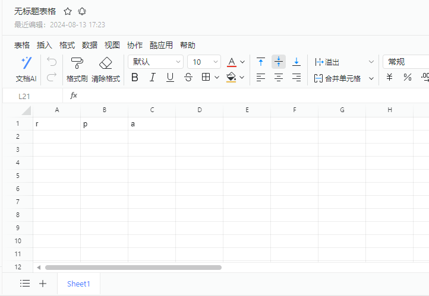
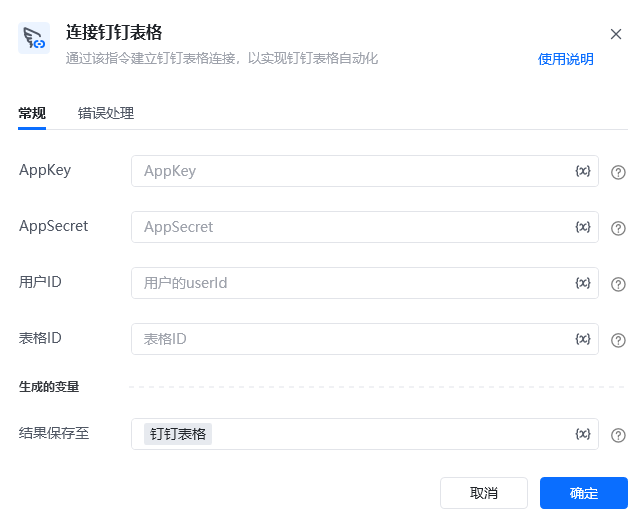

## 指令说明

**描述：** 通过该指令建立钉钉表格连接，以实现钉钉表格自动化

## 参数说明

<Tabs>
  <Tab title="常规">
    

    | 参数 | 说明 |
    | --- | --- |
    | **AppKey** | 登录钉钉开发者后台，创建应用或使用已创建过的应用，获取此参数，详细步骤可见钉钉在线表格指令表格 |
    | **AppSecret** | 登录钉钉开发者后台，创建应用或使用已创建过的应用，获取此参数，详细步骤可见使用文档钉钉在线表格指令表格 |
    | **用户ID** | 登录钉钉管理后台，在成员管理模块获取，详细步骤可见使用文档钉钉在线表格指令表格 |
    | **表格ID** | 在钉钉表格页面，可通过左上角表格>文档信息获取，详细步骤可见使用文档钉钉在线表格指令表格 |
  </Tab>
  <Tab title="高级">
    本指令暂无高级参数。
  </Tab>
</Tabs>

## 使用示例

**该流程执行逻辑：**

### 运行结果

<Info>
  使用指令过程中遇到问题？前往 [八爪鱼RPA 开发者社区问答板块](https://rpa.bazhuayu.com/community/questions) 提问，获取官方与社区帮助。
</Info>
