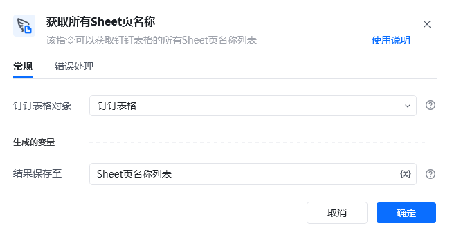
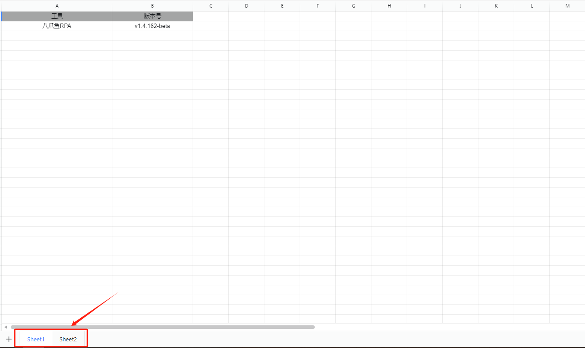
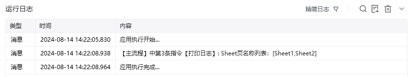

## 指令说明

**描述：** 该指令可以获取钉钉表格的所有Sheet页名称列表

## 参数说明

<Tabs>
  <Tab title="常规">

    

    | 参数 | 说明 |
    | --- | --- |
    | **钉钉表格对象** | 请选择要操作的钉钉表格对象 |
  </Tab>
  <Tab title="高级">
    本指令暂无高级参数。
  </Tab>
</Tabs>

## 使用示例

**该流程执行逻辑：**

使用【连接钉钉表格】建立与指定钉钉表格的连接，以实现钉钉表格自动化，并将其保存至钉钉表格中

使用【获取所有Sheet页名称】获取钉钉表格中所有Sheet页名称，并将其保存至Sheet页名称列表

使用【打印日志】打印Sheet页名称列表消息日志

### 效果展示

<Info>
  使用指令过程中遇到问题？前往 [八爪鱼RPA 开发者社区问答板块](https://rpa.bazhuayu.com/community/questions) 提问，获取官方与社区帮助。
</Info>
