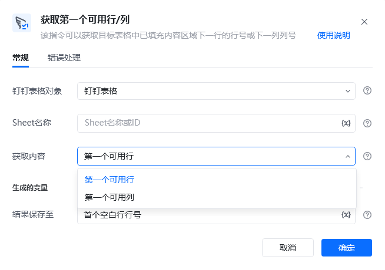
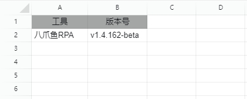
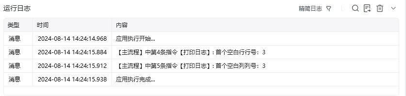

## 指令说明

**描述：** 该指令可以获取目标表格中第一个空白行行号或第一个空白列列号。

## 参数说明

<Tabs>
  <Tab title="常规">
    

    | 参数 | 说明 |
    | --- | --- |
    | **钉钉表格对象** | 请选择要操作的钉钉表格对象 |
    | **Sheet名称** | Sheet名称或ID，可直接输入或通过获取Sheet页名称获取 |
    | **获取内容** | 请选择需要获取首个空白行还是首个空白列 |
  </Tab>
  <Tab title="高级">
    本指令暂无高级参数。
  </Tab>
</Tabs>

## 使用示例

**该流程执行逻辑：**

使用【连接钉钉表格】建立与指定钉钉表格的连接，以实现钉钉表格自动化，并将其保存至钉钉表格中

使用【获取第一个可用行/列】获取首个空白行，并将其保存至首个空白行行号中

使用【获取第一个可用行/列】获取首个空白列，并将其保存至首个空白列列号中

使用【打印日志】打印首个空白行行号消息日志

使用【打印日志】打印首个空白列列号消息日志

### 效果展示

<Info>
  使用指令过程中遇到问题？前往 [八爪鱼RPA 开发者社区问答板块](https://rpa.bazhuayu.com/community/questions) 提问，获取官方与社区帮助。
</Info>
