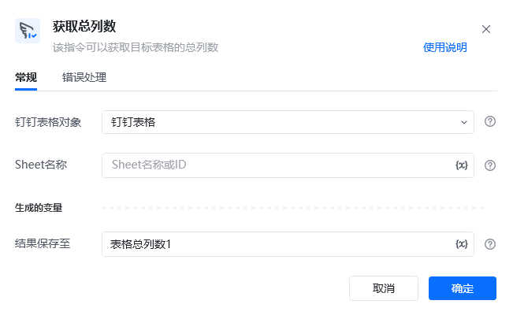
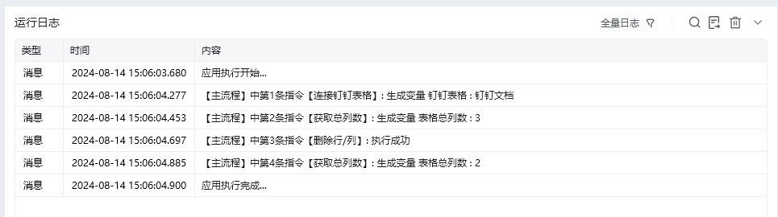

## 指令说明

**描述：** 该指令可以获取目标表格的总列数

## 参数说明

<Tabs>
  <Tab title="常规">
    

    | 参数 | 说明 |
    | --- | --- |
    | **钉钉表格对象** | 选择需要操作的钉钉表格对象 |
    | **Sheet名称** | Sheet名称或ID，可直接输入或通过获取Sheet页名称获取 |
    | **结果保存至** | 获取到的数据保存至该变量 |
  </Tab>
  <Tab title="高级">
    本指令暂无高级参数。
  </Tab>
</Tabs>

## 使用示例

**该流程执行逻辑：**

使用【连接钉钉表格】建立钉钉表格连接

使用【获取总列数】获取表格的行列数为3

使用【删除行/列】删除钉钉表格的Sheet1中第2行数据

使用【获取总列数】获取表格的列数为2

### 运行结果

<Info>
  使用指令过程中遇到问题？前往 [八爪鱼RPA 开发者社区问答板块](https://rpa.bazhuayu.com/community/questions) 提问，获取官方与社区帮助。
</Info>
