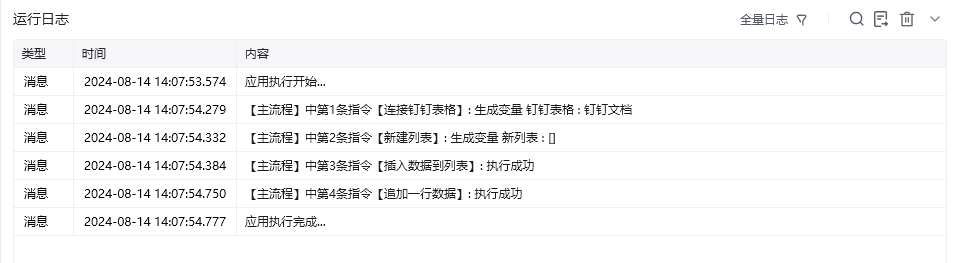
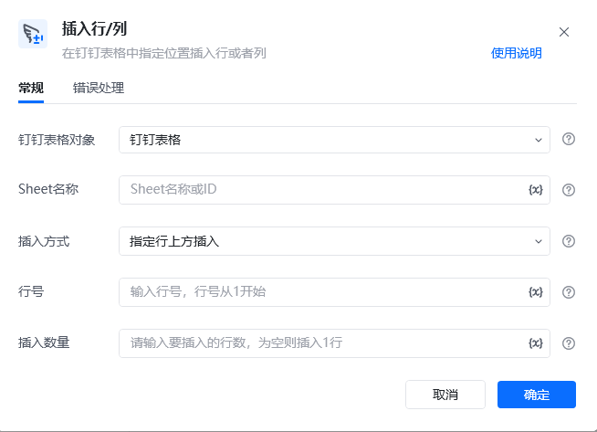

## 指令说明

**描述：** 在钉钉表格中指定位置插入行或者列

## 参数说明

<Tabs>
  <Tab title="常规">
    

    | 参数 | 说明 |
    | --- | --- |
    | **钉钉表格对象** | 选择需要操作的钉钉表格对象 |
    | **Sheet名称** | Sheet名称或ID，可直接输入或通过获取Sheet页名称获取 |
    | **插入方式** | 选择插入方式，可以往指定行上方插入1行或多行，也可以往指定列左侧插入1列或多列 |
    | **行号** | 要插入位置的行号，将在其上方插入 |
    | **列名/列号** | 要插入位置的列名/列号，将在其左侧插入 |
    | **插入数量** | 输入要插入的列数/行数，为空则插入1列/1行 |
  </Tab>
  <Tab title="高级">
    本指令暂无高级参数。
  </Tab>
</Tabs>

## 使用示例

**该流程执行逻辑：**

使用【连接钉钉表格】建立钉钉表格连接

使用【获取总行数】获取表格的行数为1

使用【插入行/列】在钉钉表格的Sheet1中第1行上方插入2行

使用【获取总行数】获取表格的行数为3

### 效果展示

<Info>
  使用指令过程中遇到问题？前往 [八爪鱼RPA 开发者社区问答板块](https://rpa.bazhuayu.com/community/questions) 提问，获取官方与社区帮助。
</Info>
