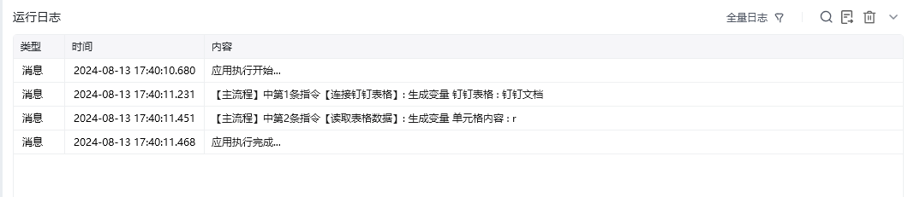
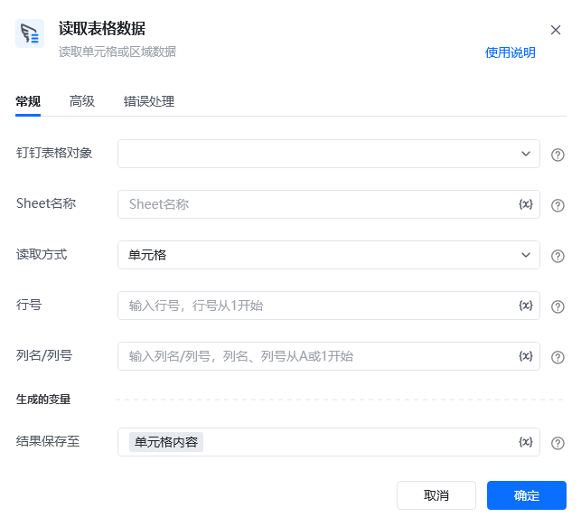

## 指令说明

**描述：** 读取钉钉表格的单元格数据或区域数据

## 参数说明

<Tabs>
  <Tab title="常规">
    

    | 参数 | 说明 |
    | --- | --- |
    | **钉表格对象** | 选择需要读取的钉钉表格对象 |
    | **Sheet名称** | Sheet名称或ID，可直接输入或通过获取Sheet页名称获取 |
    | **读取方式** | 请选择读取方式，可以读取指定单元格、指定行、指定列或指定区域的内容 |
    | **行号** | 读取方式选中指定行之后需要选择，选择要读取的行的行号，从1开始 |
    | **列名/列号** | 读取方式选中指定列之后需要选择，选择要读取的列的列名/列号，从A或1开始 |
    | **开始行号** | 读取方式选中指定区域之后需要选择，选择要读取区域的开始行，输入行号，从1开始 |
    | **结束行** | 读取方式选中指定区域之后需要选择，选择读取结束行，从1开始 |
    | **开始列** | 读取方式选中指定区域之后需要选择，选择要读取区域的开始列，输入列名/列号，从A或1开始 |
    | **结束列** | 读取方式选中指定区域之后需要选择，选择读取结束列，输入列名/列号，从A或1开始 |
  </Tab>
  <Tab title="高级">
    | 参数 | 说明 |
    | --- | --- |
    | **读取格式** | 值：单元格的真实值，如果是公式则显示公式计算后的结果、 公式：单元格的公式、 显示值：在表格界面上所看到的结果 |
  </Tab>
</Tabs>

## 使用示例

**该流程执行逻辑：**

使用【连接钉钉表格】建立钉钉表格连接；

使用【读取表格数据】读取钉钉表格Sheet1的第一行第一列的单元格数据。

### 运行结果

<Info>
  使用指令过程中遇到问题？前往 [八爪鱼RPA 开发者社区问答板块](https://rpa.bazhuayu.com/community/questions) 提问，获取官方与社区帮助。
</Info>
