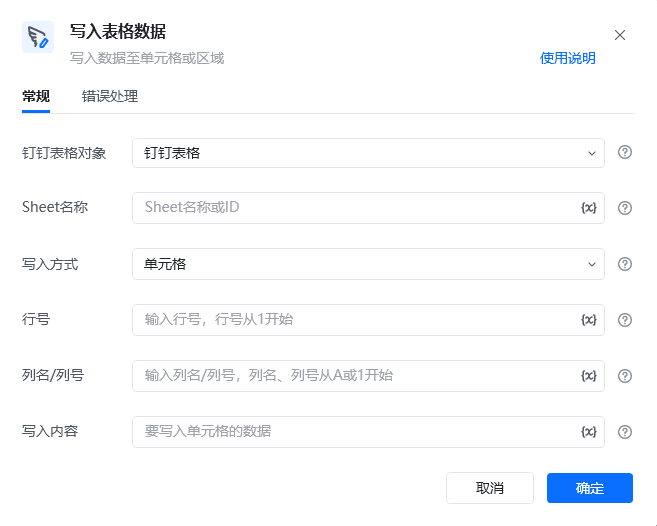
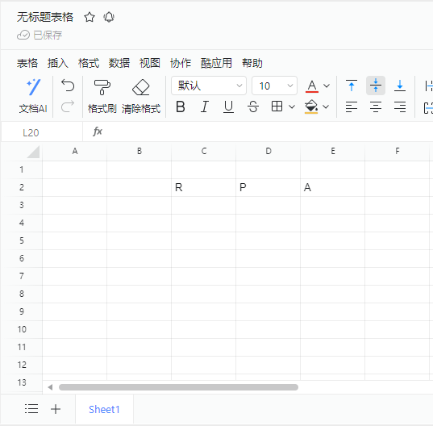
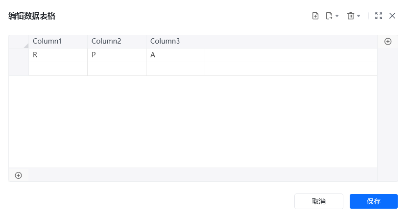

## 指令说明

**描述：** 写入数据至单元格或区域

## 参数说明

<Tabs>
  <Tab title="常规">
    

    | 参数 | 说明 |
    | --- | --- |
    | **钉钉表格对象** | 选择需要操作的钉钉表格对象 |
    | **Sheet名称** | Sheet名称或ID，可直接输入或通过获取Sheet页名称获取。推荐使用Sheet名称。 |
    | **写入方式** | 请选择写入方式，可以往指定单元格、指定行、指定列或指定区域写入内容 |
    | **行号** | 写入方式选中指定列或指定单元格之后需要选择，选择要写入的行的行号 |
    | **列名/列号** | 写入方式选中指定列或指定单元格之后需要选择，选择要写入的列的列名/列号，从A或1开始 |
    | **开始行号** | 写入方式选中指定区域之后需要选择，选择要写入区域的开始行，输入行号，从1开始 |
    | **开始列** | 写入方式选中指定区域之后需要选择，选择要写入区域的开始列，输入列名/列号，从A或1开始 |
  </Tab>
  <Tab title="高级">
    本指令暂无高级参数。
  </Tab>
</Tabs>

## 使用示例

**该流程执行逻辑：**

使用【连接钉钉表格】建立钉钉表格连接

使用【写入表格数据】在表格的Sheet1页，从滴2行第3列开始插入指定表格数据。

### 运行结果

<Info>
  使用指令过程中遇到问题？前往 [八爪鱼RPA 开发者社区问答板块](https://rpa.bazhuayu.com/community/questions) 提问，获取官方与社区帮助。
</Info>
