## 邮件指令介绍

邮件模块为我们提供电子邮件的收发以及邮件的操作功能，覆盖的指令包括：

登录邮箱、发送邮件、获取邮件、移动邮件、删除邮件、回复邮件、标记邮件、获取邮件内容、下载邮件附件

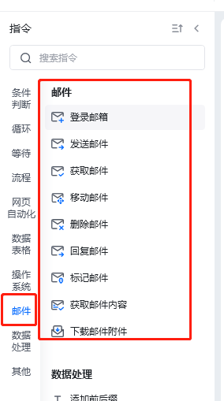

## 使用说明

当我们需要使用邮件功能时，我们需要先使用『**登录邮箱**』指令来登录对应的邮箱，而后才可以使用『**获取邮件**』指令来读取登录成功后的邮箱的邮件，使用『**发送邮件**』指令实现给某个人发送电子邮件。

通过『**获取邮件**』获取到邮件（邮件列表）后，我们可以使用『**列表循环**』指令实现对邮件进行逐封处理的操作（回复、移动、删除、标记、下载附件、读取内容等）。

### 登录邮箱

配置邮箱的登录信息，支持部分常用邮箱的快速配置以及自定义邮箱配置

**配置参数说明**

邮箱类型：设置要登录的邮箱类型，可以选择某个常用邮箱，如果要使用的邮箱不在列表里，可使用自定邮箱

用户名：登录邮箱的登录名，大部分情况是邮箱账号，也有部分邮箱支持手机、用户名等方式登录

密码/授权码：登录邮箱的凭证，可以是登录密码（与邮箱的Web平台一直），部分邮箱需要使用客户端独立的登录授权码，如QQ企业邮箱

[SMTP](https://zhuanlan.zhihu.com/p/577921713)服务器：邮箱的SMTP服务器的链接

SMTP端口号：邮箱的SMTP服务器的端口

IMAP服务器：邮箱的IMAP服务器的链接

IMAP端口号：邮箱的IMAP服务器的端口

使用[SSL](https://zhidao.baidu.com/question/1924858203481775827.html)：部分邮箱需要使用SSL方式登录，如果是则勾选这个配置

配置信息的获取可参考“[如何获取邮箱的登录配置信息](internal)”

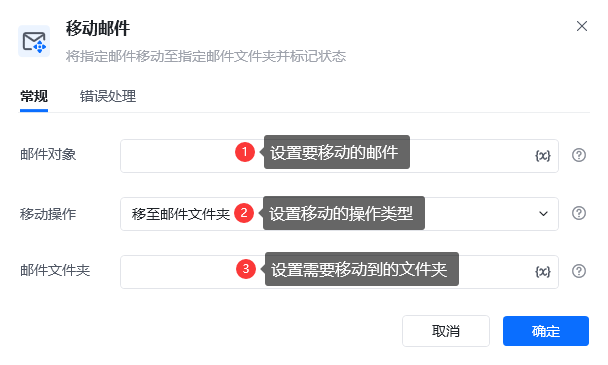

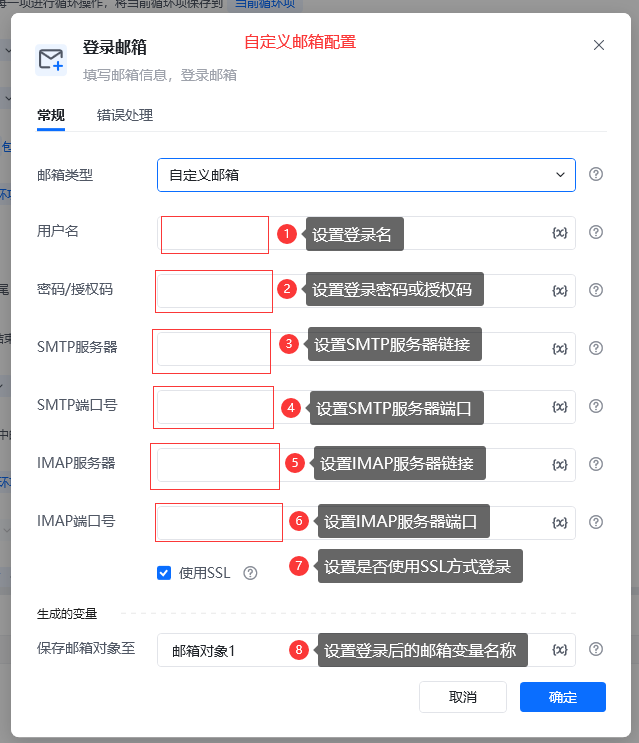

### 获取邮件

收取登录成功的邮箱里的电子邮件，获取到的邮件会保存到一个邮件列表对象里，可使用列表循环指令逐个处理每个邮件，也可以使用下标定位(邮箱列表[1])处理某个邮件

**配置参数说明**

邮箱对象：选择登录成功的邮箱对象

邮件数量：设置一次要获取多少封邮件

获取范围：设置要获取哪些邮件，可以选所有邮件、已读邮件、未读邮件

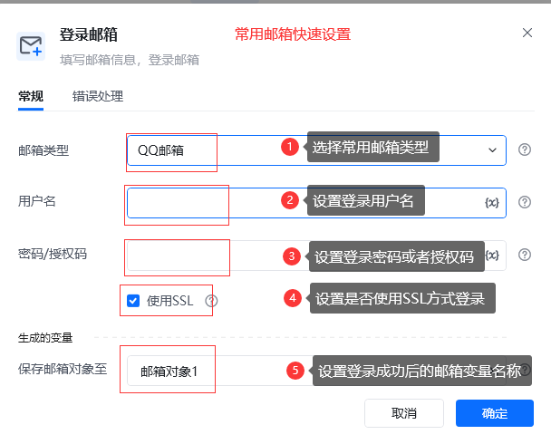

### 发送邮件

使用登录成功的邮箱发送电子邮件

**配置参数说明**

邮箱对象：选择登录成功的邮箱对象

发件人：设置发送邮件的电子邮件账号，由于登录邮箱的登录名可能不是电子邮箱账号，估需要在这里指定

发件人名称：设置发件人名称，设置后收件人看的发件人会显示为"**发件人名称&lt;xxx@xxx.com&gt;**"

收件人：设置邮件的主要收件人

抄送人：设置邮件的抄送人

密送人：设置邮件的密送人

主题：设置邮件的主题

正文：设置邮件的正文

HTML格式：指定邮件内容是否有HTML格式的

附件：设置邮件的附件

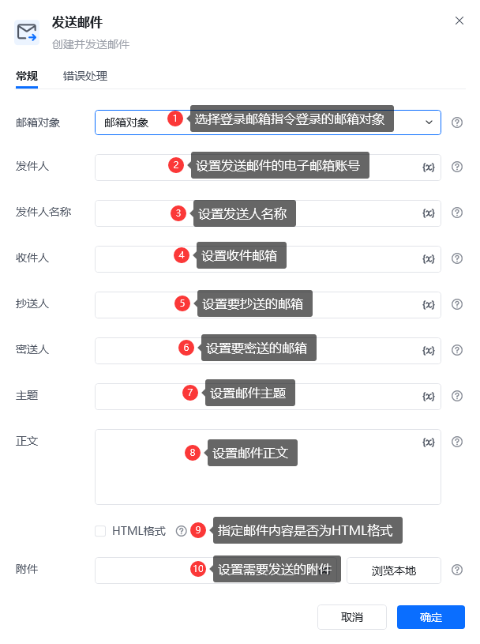

### 移动邮件

把某个邮件移动到知道的邮箱文件夹里

**配置参数说明**

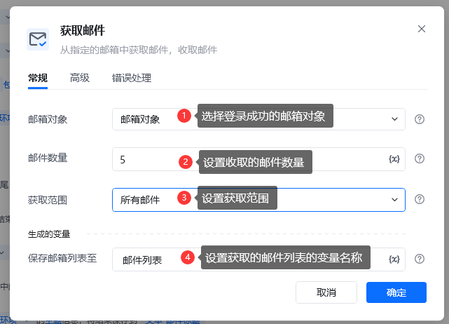

### 删除邮件

删掉某个邮件

**配置参数说明**

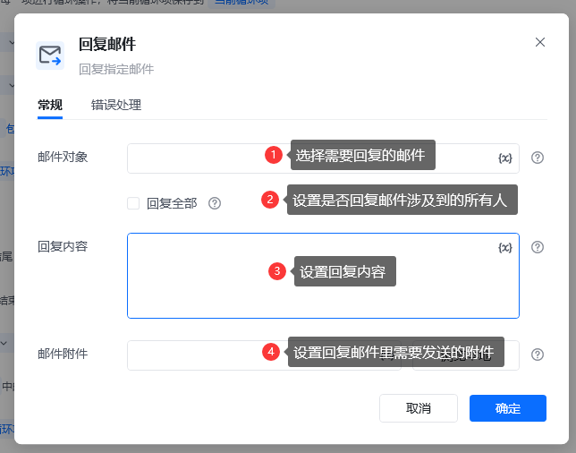

### 回复邮件

回复某个邮件

**配置参数说明**

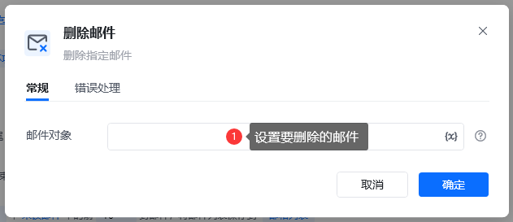

### 标记邮件

把某个邮件标记为已读或者是未读

**配置参数说明**

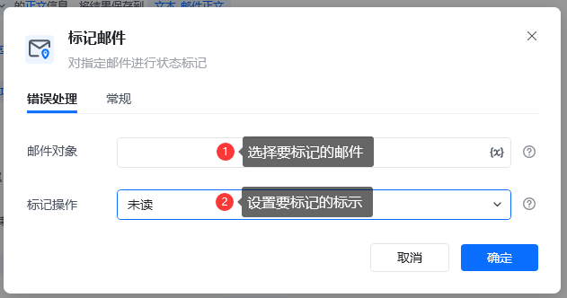

### 获取邮件内容

读取某个邮件的内容，包括主题、正文、收件人、发件人

**配置参数说明**

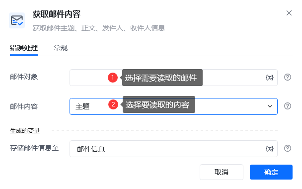

### 下载邮件附件

下载某个邮件包含的所有附件，下载成功后会把下载后的文件路径保存到一个列表里

**配置参数说明**

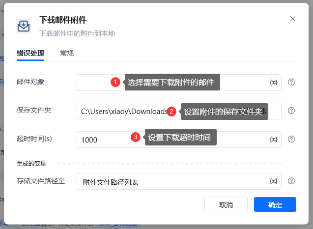

<Info>
  使用过程中遇到问题？前往 [八爪鱼RPA 开发者社区问答板块](https://rpa.bazhuayu.com/community/questions) 提问，获取官方与社区帮助。
</Info>
