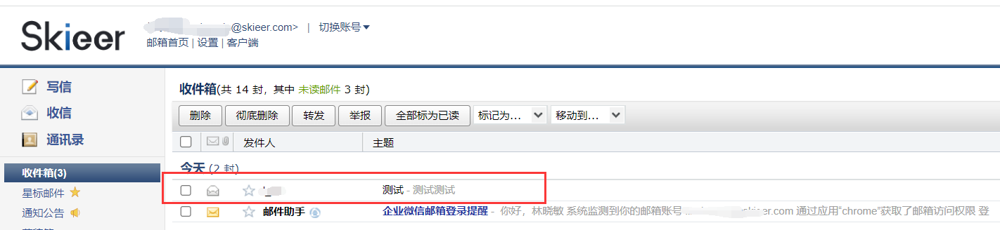
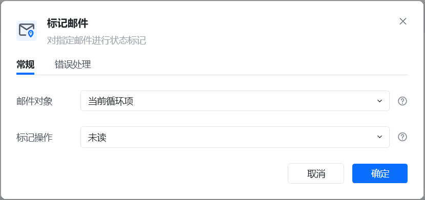
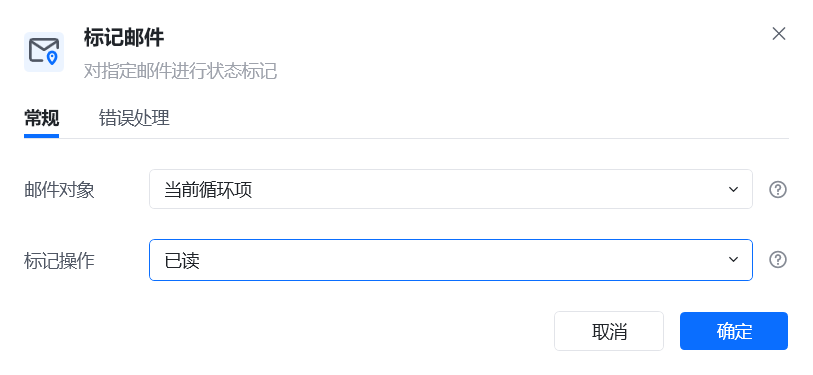
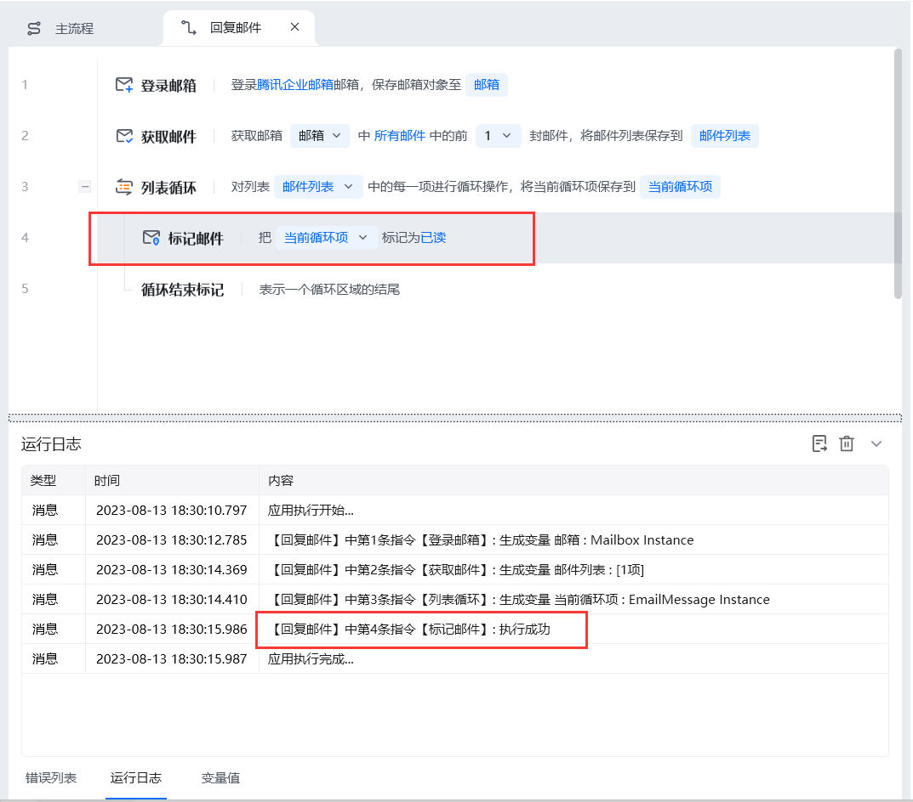

## 指令说明

**描述：** 对指定的邮件标注为已读或未读

## 参数说明

<Tabs>
  <Tab title="常规">
    

    | 参数 | 说明 |
    | --- | --- |
    | **邮件对象** | 选择需要标记的邮件对象。这个邮件得先从邮箱中获取，把获取到的邮箱列表依次进行循环，每个循环项即是每一封可以进行回复的邮件。 |
    | **标记操作** | 可以标记为已读或未读 |
    | **该流程执行逻辑：** | 【登录邮箱】登录企业邮箱 |
  </Tab>
  <Tab title="高级">
    本指令暂无高级参数。
  </Tab>
</Tabs>

## 使用示例

**该流程执行逻辑：**

### 效果展示

<Info>
  使用指令过程中遇到问题？前往 [八爪鱼RPA 开发者社区问答板块](https://rpa.bazhuayu.com/community/questions) 提问，获取官方与社区帮助。
</Info>
