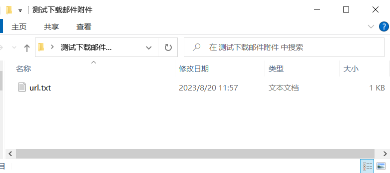
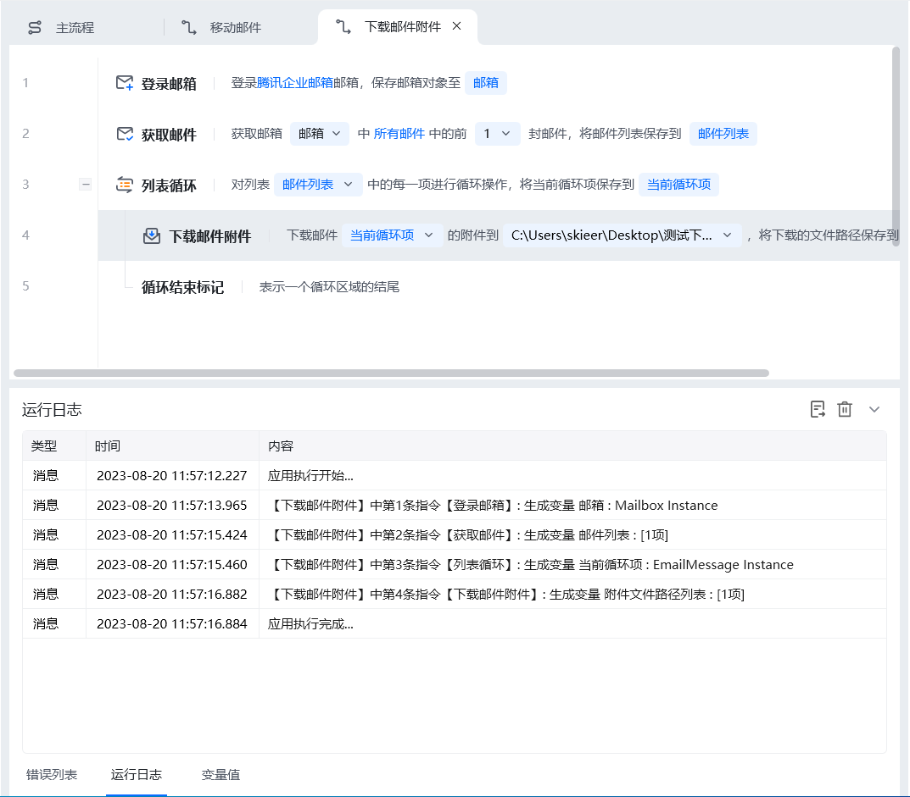
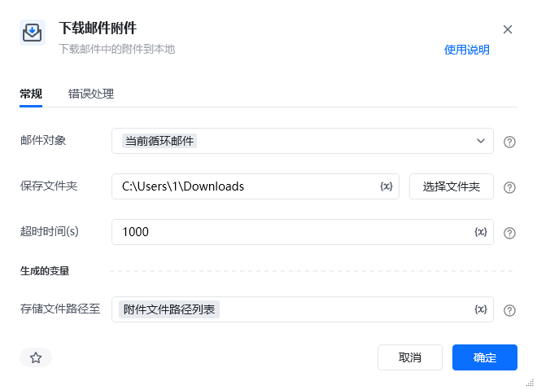
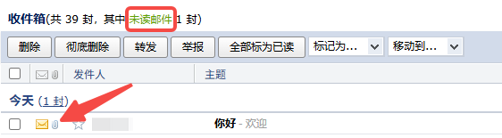

## 指令说明

**描述：** 下载邮件中的附件到本地

## 参数说明

<Tabs>
  <Tab title="常规">
    

    | 参数 | 说明 |
    | --- | --- |
    | **邮件对象** | 选择当前要进行操作的邮件对象，通过【登录邮箱】指令获取该对象 |
    | **保存文件夹** | 选择下载后附件保存的文件夹地址 |
    | **超时时间** | 等待下载附件的最长时间 |
    | **存储文件路径至** | 指定一个变量名称，将下载后的文件的路径存储到这个变量里 |
  </Tab>
  <Tab title="高级">
    本指令暂无高级参数。
  </Tab>
</Tabs>

## 使用示例

**该流程执行逻辑：**

登录企业邮箱 ---> 获取第一封邮件 ---> 把获取到的邮箱列表依次进行循环，每个循环项即是每一封即将进行操作的邮件 --->使用【下载邮件附件】将邮件中的附件下载到本地指定的文件夹中

效果展示：

RPA运行前

RPA运行后

### 运行结果

<Info>
  使用指令过程中遇到问题？前往 [八爪鱼RPA 开发者社区问答板块](https://rpa.bazhuayu.com/community/questions) 提问，获取官方与社区帮助。
</Info>
