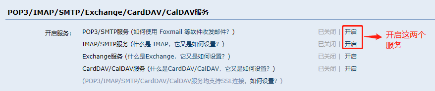
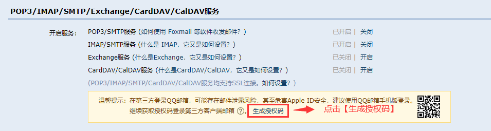
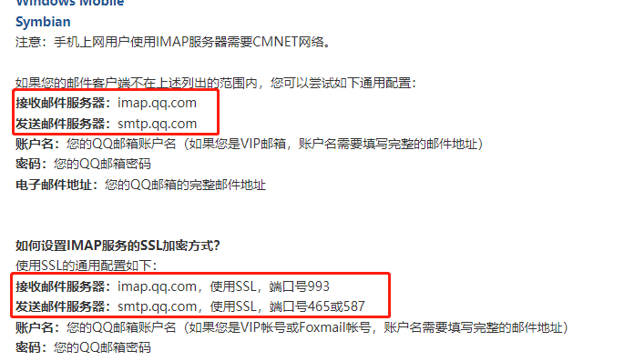
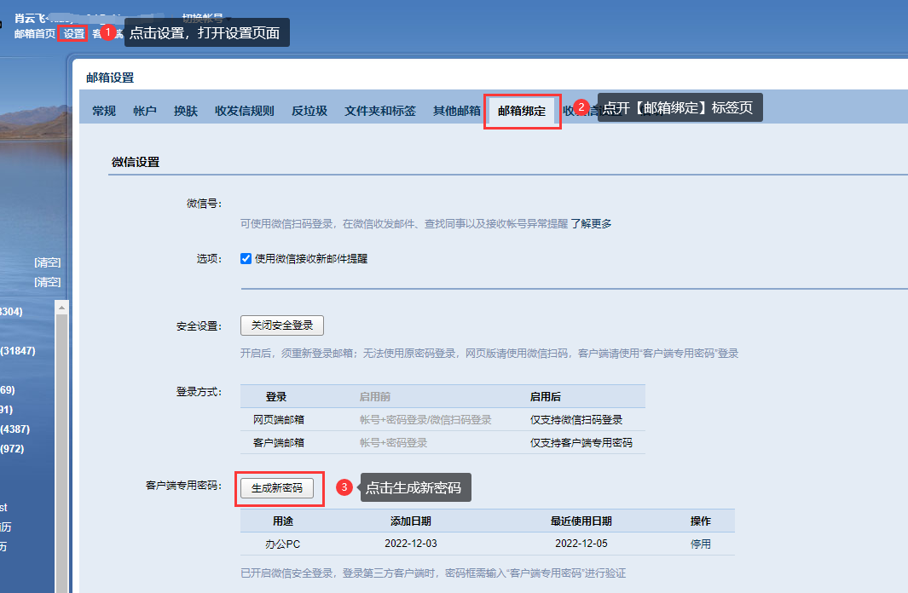
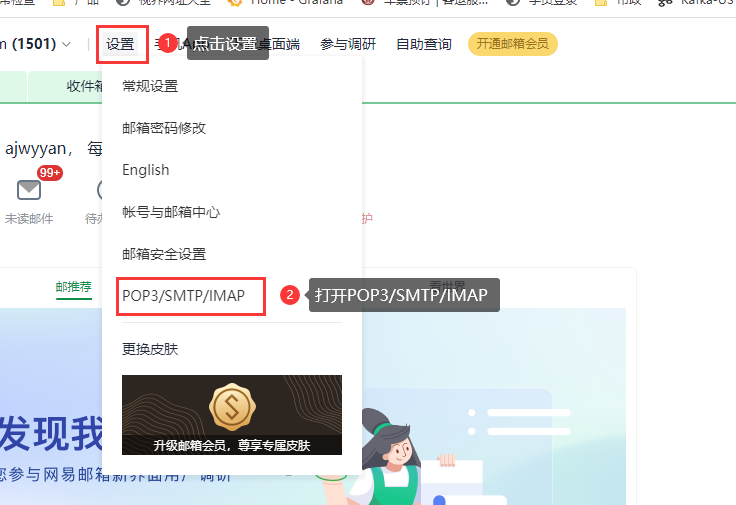
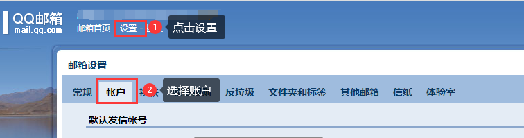
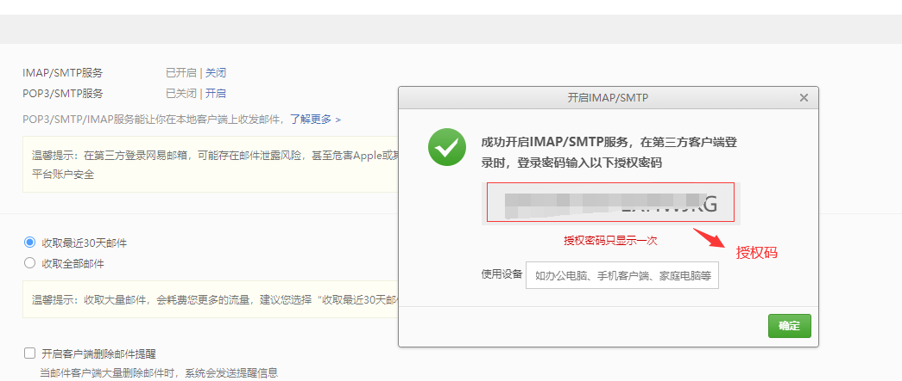
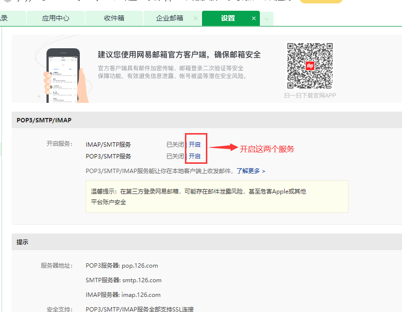

### 如何获取SMTP、IMAP服务器信息

SMTP和IMAP是一种的电子邮件传输的协议。每个电子邮件服务厂商都会有自己的SMTP和IMAP服务器。

1、大部分电子邮件服务厂商的SMTP、IMAP服务器信息可以在其官方的帮助中心查询到

2、自建邮箱询问公司的IT同事。

3、百度搜索"xxx邮箱 SMTP"即可

以QQ邮箱为例，QQ邮箱的SMTP、IMAP服务器信息公开在其官网上：**[如何使用IMAP服务？](https://service.mail.qq.com/cgi-bin/help?subtype=1&id=28&no=331)**

### 如何获取邮箱的客户端登录授权码

授权码是部分邮件服务厂商推出的，用于登录第三方客户端的专用密码（即授权码），绝大部分厂商在Web登录邮箱后可以设置

**QQ邮箱授权码获取方式**

官方介绍：**[什么是授权码，微信登录的账号如何使用授权码？](https://service.mail.qq.com/cgi-bin/help?subtype=1&&id=28&&no=1001607)**

**QQ企业邮箱授权码获取方式**

**网易126邮箱授权码获取方式**

<Info>
  使用过程中遇到问题？前往 [八爪鱼RPA 开发者社区问答板块](https://rpa.bazhuayu.com/community/questions) 提问，获取官方与社区帮助。
</Info>
