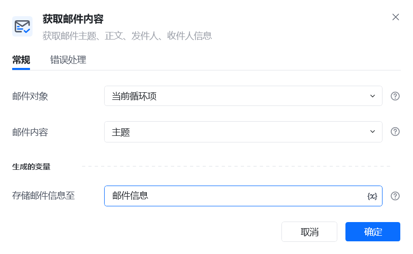
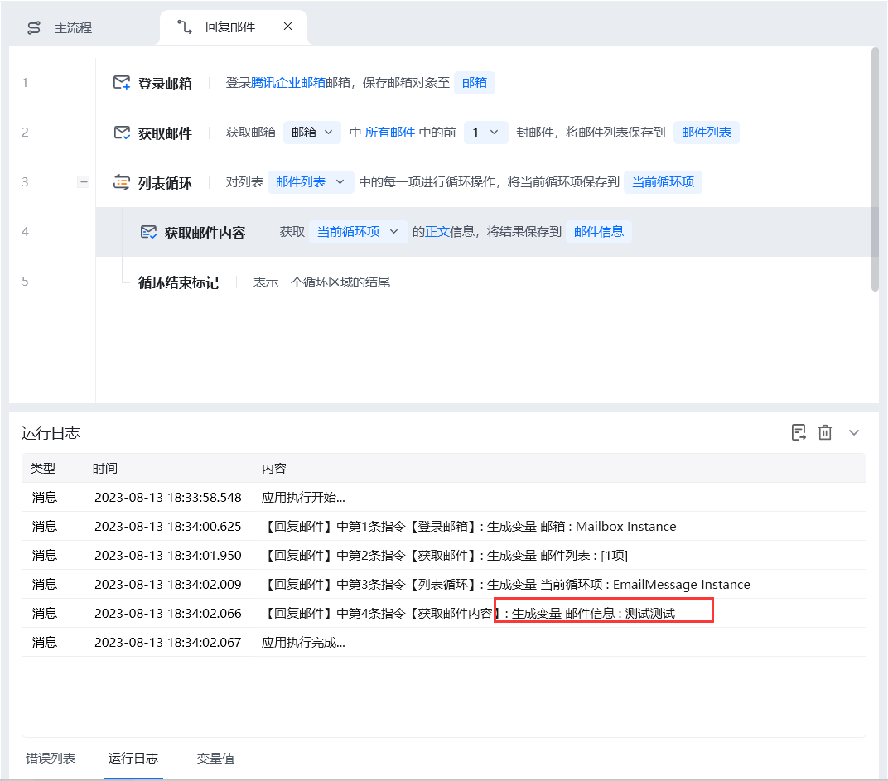

## 指令说明

**描述：** 获取邮件的主题、正文、发件人、收件人的信息

## 参数说明

<Tabs>
  <Tab title="常规">
    

    | 参数 | 说明 |
    | --- | --- |
    | **邮件对象** | 选择需要标记的邮件对象。这个邮件得先从邮箱中获取，把获取到的邮箱列表依次进行循环，每个循环项即是每一封可以进行回复的邮件。 |
    | **邮件内容** | 获取邮件的主题、正文、发件人、收件人 |
    | **存储邮件信息至** | 把获取到的信息保存到变量 |
  </Tab>
  <Tab title="高级">
    本指令暂无高级参数。
  </Tab>
</Tabs>

## 使用示例

**该流程执行逻辑：**

1. 使用【登录邮箱】创建邮箱对象，再获取需要读取的邮件对象。
2. 在【获取邮件内容】中指定要读取的内容类型，例如主题、正文或发件人信息。
3. 将读取结果保存到指定变量，供后续判断、文本处理或日志输出使用。

### 效果展示

执行完成后，所选邮件内容将保存至指定变量。

<Info>
  使用指令过程中遇到问题？前往 [八爪鱼RPA 开发者社区问答板块](https://rpa.bazhuayu.com/community/questions) 提问，获取官方与社区帮助。
</Info>
