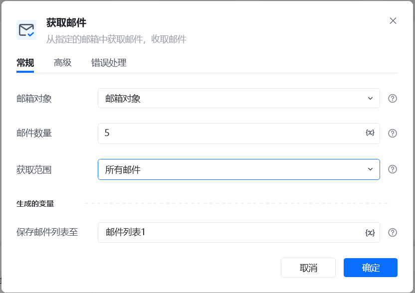
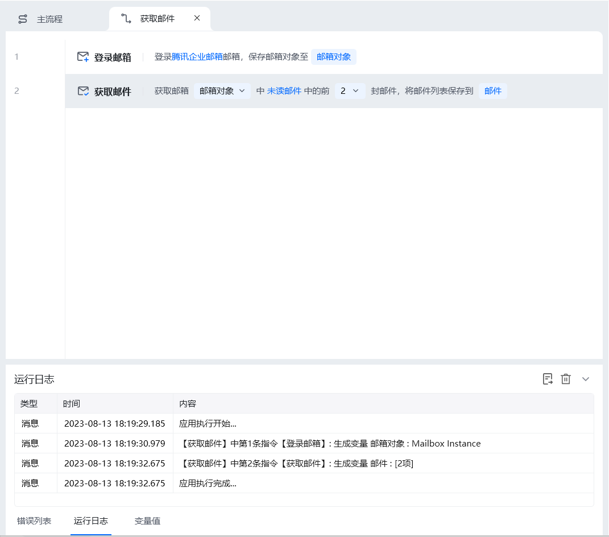
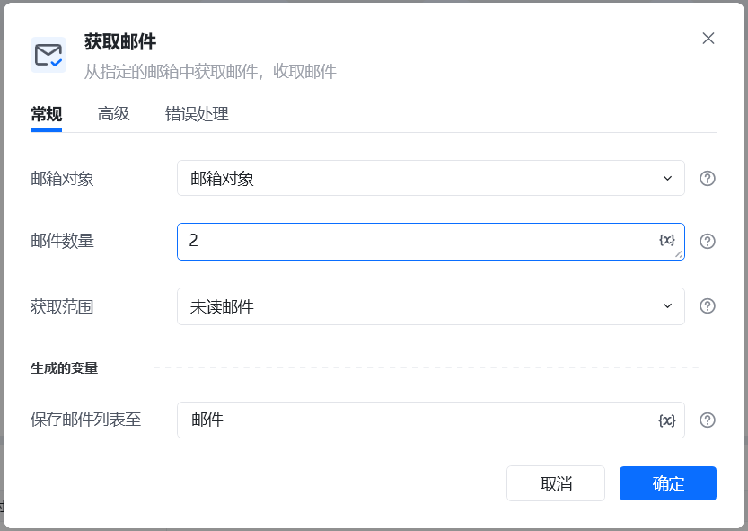

## 指令说明

**描述：**从指定邮箱中获取邮件

## 参数说明

<Tabs>
  <Tab title="常规">
    

    | 参数 | 说明 |
    | --- | --- |
    | **邮箱对象** | 选择已设置登录的邮箱对象 |
    | **邮件数量** | 设置要获取的邮件数量 |
    | **获取范围** | 所有邮件、未读邮件、已读邮件 |
    | **保存邮件列表至** | 将获取到的邮箱列表保存到变量 |
  </Tab>
  <Tab title="高级">
    

| 参数 | 说明 |
| --- | --- |
| **指定邮箱文件夹** | 默认：当前邮箱对象的默认邮箱文件夹、 指定文件夹：如果读取当前邮箱对象的指定文件夹，文件夹名称要加前缀“其他文件夹/” |
| **标记为已读** | 勾选后，获取到邮件后将邮件标记为已读 |
| **“发件人”字段包含** | 请输入要匹配的发件人 |
| **“收件人”字段包含** | 请输入要匹配的收件人 |
| **“主题”包含** | 请输入要过滤的主题字段 |
| **“正文”包含** | 请输入要匹配的正文内容 |
  </Tab>
</Tabs>

## 使用示例

**该流程执行逻辑：**

### 运行结果

<Info>
  使用指令过程中遇到问题？前往 [八爪鱼RPA 开发者社区问答板块](https://rpa.bazhuayu.com/community/questions) 提问，获取官方与社区帮助。
</Info>
