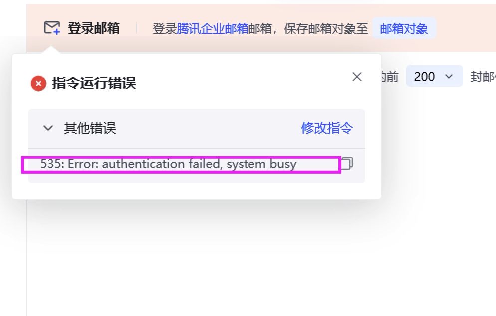
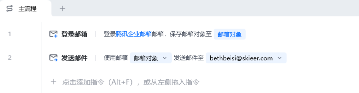
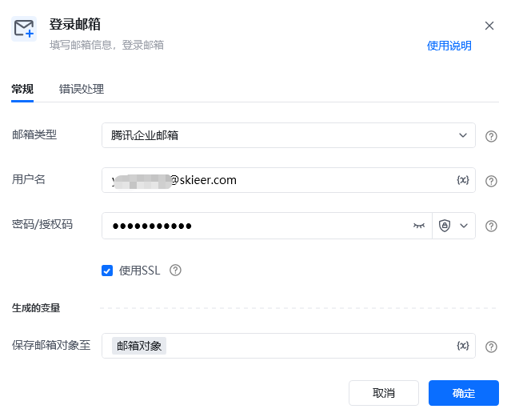
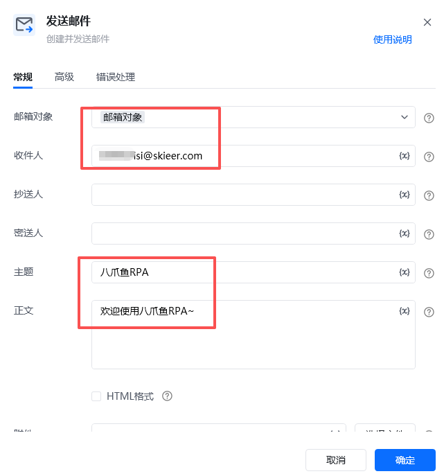
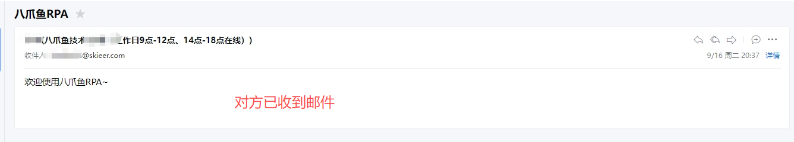
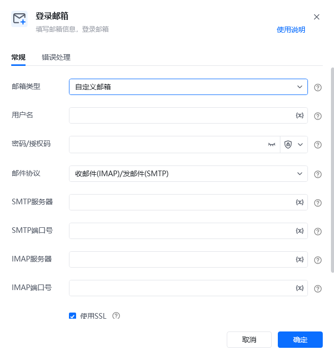

## 指令说明

**描述：** 填写邮箱信息，用于登录邮箱

## 参数说明

<Tabs>
  <Tab title="常规">
    

    | 参数 | 说明 |
    | --- | --- |
    | **邮箱类型** | QQ邮箱、163邮箱、126邮箱、腾讯企业邮箱、网易企业邮箱、Outlook、谷歌邮箱、自定义邮箱 |
    | **用户名** | 填入要登录的邮箱的用户名 |
    | **密码/授权码** | 密码：输入邮箱密码、 授权码：授权码的获取方式可参考 如何获取邮箱的登录配置信息 |
    | **使用SSL** | 勾选是否使用SSL，一般在具体的邮箱个人设置中配置 |
  </Tab>
  <Tab title="高级">
    本指令暂无高级参数。
  </Tab>
</Tabs>

## 使用示例

**该流程执行逻辑：**

【登录邮箱】登录腾讯企业邮箱

【发送邮件】填写接收邮箱（如有多个可用分号隔开），填写主题正文并添加附件，发送邮件。

### 运行结果

## 常见报错处理

报错信息： Error: authentication falled, system busy

原因是没有勾选上开启IMAP/SMTP服务 和 开启POP/SMTP服务，把这两个勾选上即可。

## 使用小Tips

支持【自定义邮箱】

<Info>
  使用指令过程中遇到问题？前往 [八爪鱼RPA 开发者社区问答板块](https://rpa.bazhuayu.com/community/questions) 提问，获取官方与社区帮助。
</Info>
