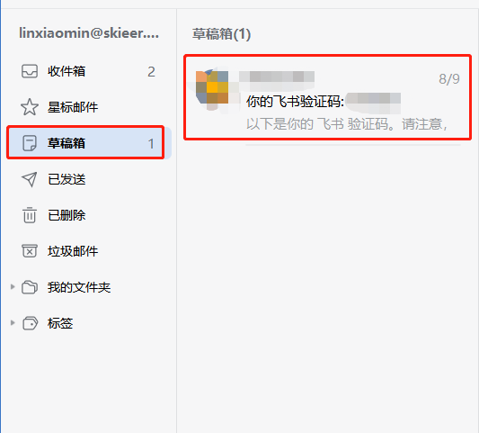
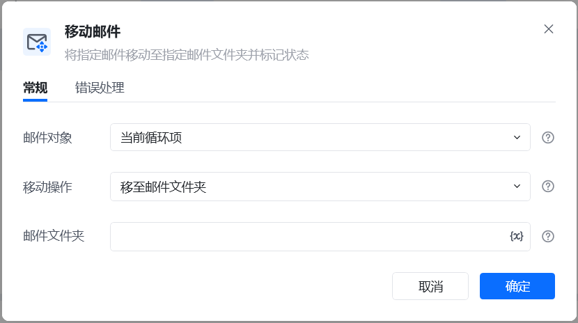
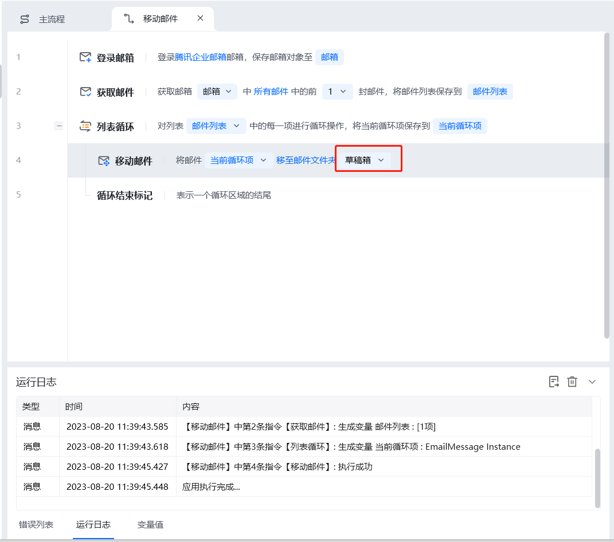

## 指令说明

**描述：** 将指定邮件移动至指定的邮件文件夹中，还可以对邮件的状态进行标记

## 参数说明

<Tabs>
  <Tab title="常规">
    

    | 参数 | 说明 |
    | --- | --- |
    | **邮件对象** | 选择当前要进行操作的邮件对象 |
    | **邮件文件夹** | 邮件移动的目标文件夹 |
    | **该流程执行逻辑：** | 【登录邮箱】登录企业邮箱 |
  </Tab>
  <Tab title="高级">
    本指令暂无高级参数。
  </Tab>
</Tabs>

## 使用示例

**该流程执行逻辑：**

### 运行结果

<Info>
  使用指令过程中遇到问题？前往 [八爪鱼RPA 开发者社区问答板块](https://rpa.bazhuayu.com/community/questions) 提问，获取官方与社区帮助。
</Info>
