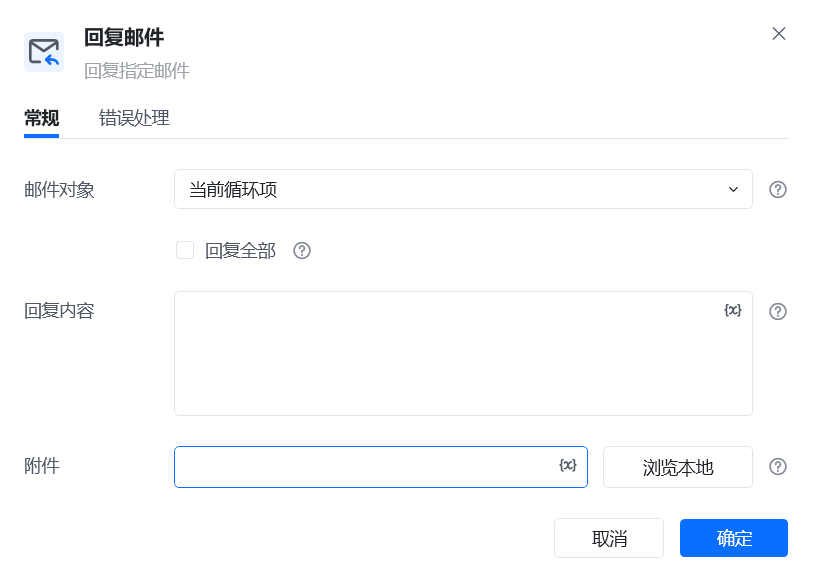
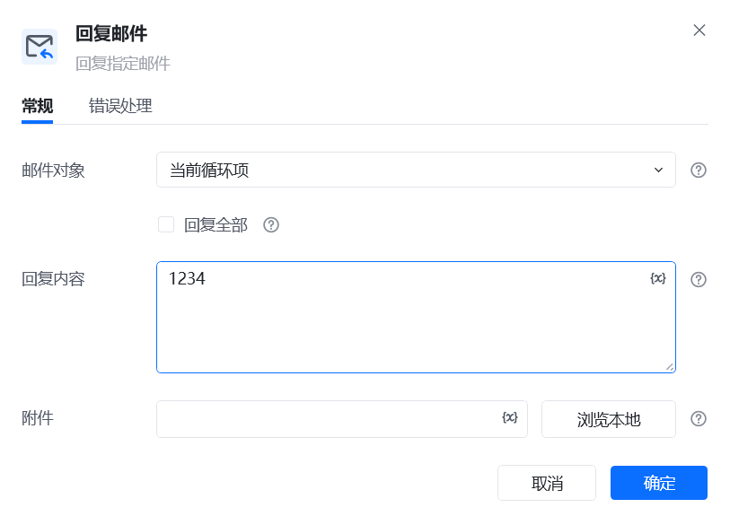
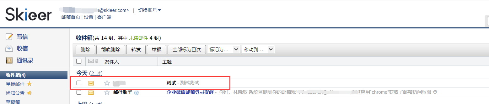
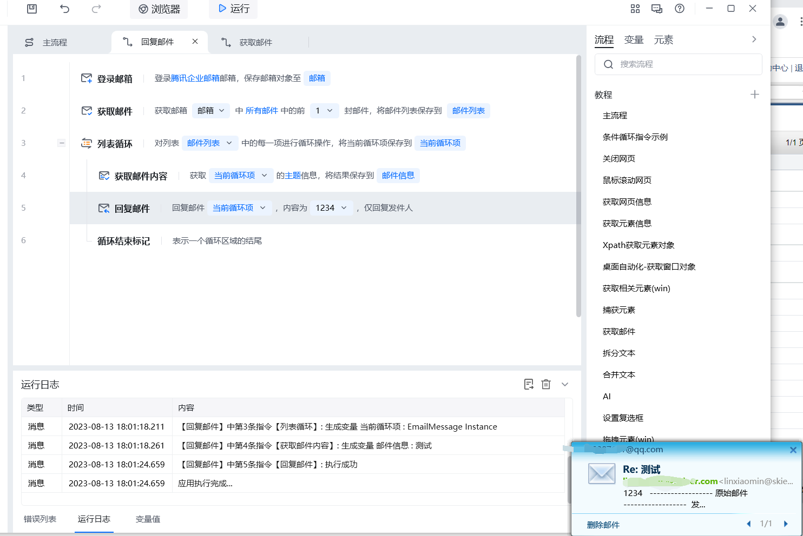

## 指令说明

**描述：** 回复邮箱收件箱中指定的邮件

## 参数说明

<Tabs>
  <Tab title="常规">
    

    | 参数 | 说明 |
    | --- | --- |
    | **邮件对象** | 选择要回复的邮件。这个邮件得先从邮箱中获取，把获取到的邮箱列表依次进行循环，每个循环项即是每一封可以进行回复的邮件 |
    | **回复全部** | 如勾选回复全部，则会对邮件中提到的所有人进行回复，如果不勾选，则只回复发件人 |
    | **回复内容** | 输入要回复的内容 |
    | **附件** | 添加附件 |
  </Tab>
  <Tab title="高级">
    本指令暂无高级参数。
  </Tab>
</Tabs>

## 使用示例

**该流程执行逻辑：**

1. 使用【登录邮箱】创建邮箱对象，再获取需要回复的邮件对象。
2. 在【回复邮件】中填写回复正文和附件，并按需要设置是否回复全部收件人。
3. 运行后，回复内容发送给对应联系人，并保留在邮箱的已发送记录中。

### 效果展示

<Info>
  使用指令过程中遇到问题？前往 [八爪鱼RPA 开发者社区问答板块](https://rpa.bazhuayu.com/community/questions) 提问，获取官方与社区帮助。
</Info>
