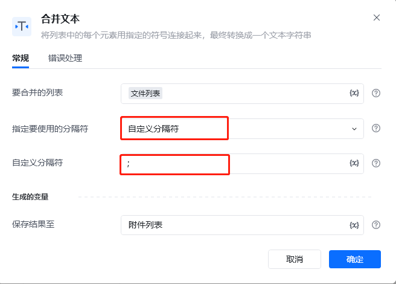
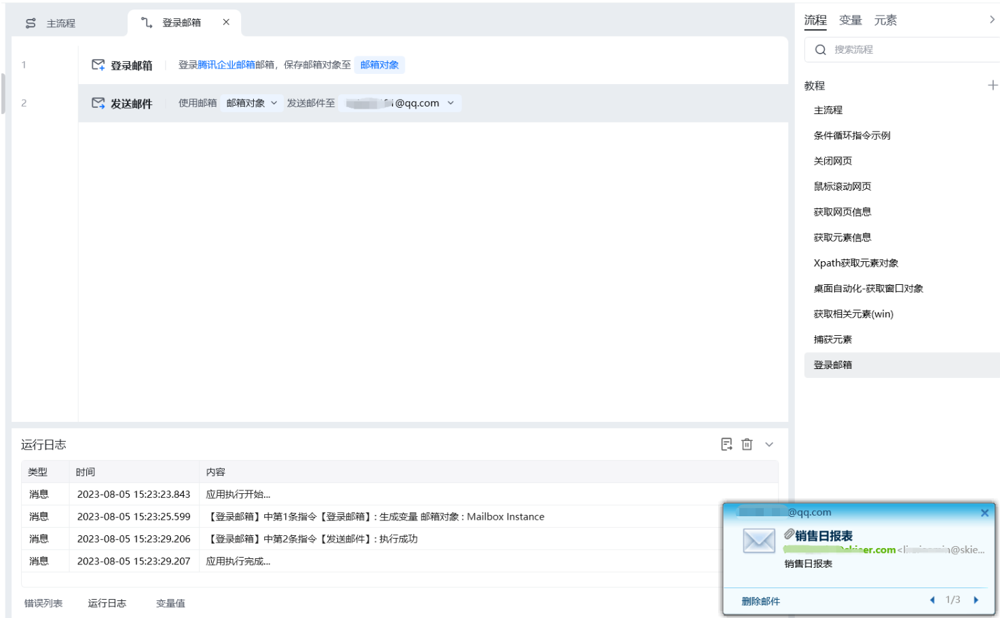
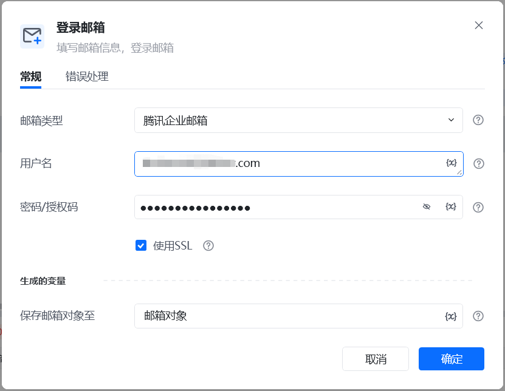
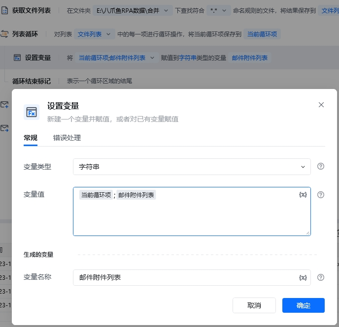
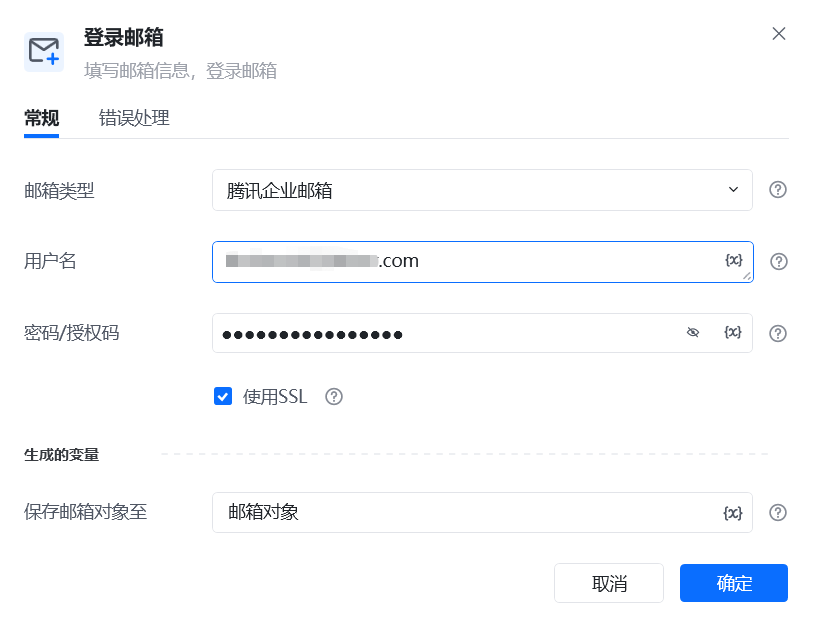
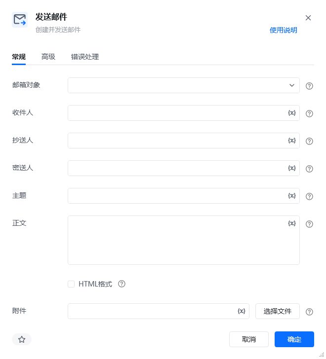

## 指令说明

**描述：** 该指令用于发送邮件

## 参数说明

<Tabs>
  <Tab title="常规">
    

    | 参数 | 说明 |
    | --- | --- |
    | **邮箱对象** | 输入一个获取到的或者通过"登录邮箱"创建的邮箱对象 |
    | **收件人** | 填写收件人邮箱地址，如有多个可用分号隔开 |
    | **抄送人/密送人** | 填写邮件的抄送人/密送人 |
    | **主题** | 填写邮件主题 |
    | **正文** | 填写邮件正文 |
    | **HTML格式** | 勾选框，如果勾选，邮件正文就是HTML格式 |
    | **附件** | 选择文件所在的路径，多个文件可以用分号隔开。目前直接选择只能选一个；要上传多个附件，可以手输路径或者使用变量。例如：C:\Users\Administrator\Desktop\八爪鱼RPA数据1.xlsx;C:\Users\Administrator\Desktop\八爪鱼RPA数据2.xlsx |
  </Tab>
  <Tab title="高级">
    本指令暂无高级参数。
  </Tab>
</Tabs>

## 使用示例

**该流程执行逻辑：**

【登录邮箱】登录腾讯企业邮箱 --->【发送邮件】填写接收邮箱（如有多个可用分号隔开），填写主题正文并添加附件，发送邮件

### 运行结果

使用小Tips

1. 如果是要读取某个文件夹中的全部文件当做附件进行发送，可以用这个【读取文件列表】获取到所有文件的路径，并生成一个文本列表；然后用【列表循环】和【设置变量】，将这个文本列表转成字符串，最后发送附件时用这个字符串。

PS:上面方法也可以优化下，将第2、3、4改成【合并文本】。实现将文件列表（文本列表类型的变量）转换成邮件附件列表（字符串类型的变量）。

<Info>
  使用指令过程中遇到问题？前往 [八爪鱼RPA 开发者社区问答板块](https://rpa.bazhuayu.com/community/questions) 提问，获取官方与社区帮助。
</Info>
