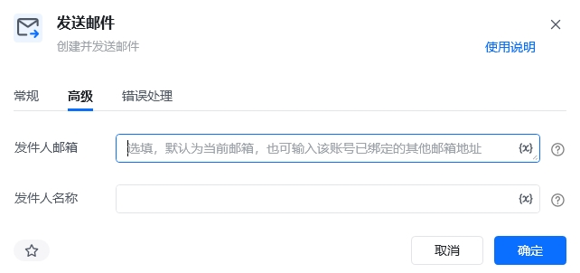
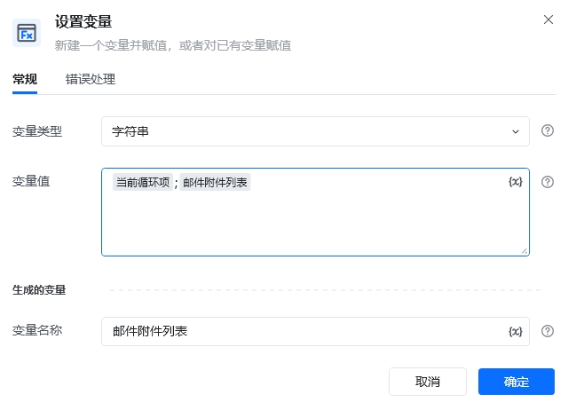
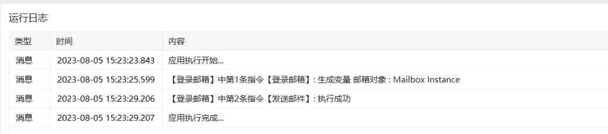
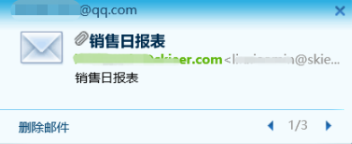

## 指令说明

**描述：** 根据收件人、主题、正文和附件等配置创建并发送邮件。

## 参数说明

<Tabs>
  <Tab title="常规">
    

    | 参数 | 说明 |
    | --- | --- |
    | **邮箱对象** | 输入一个已获取的邮箱对象，通常由【登录邮箱】指令创建。 |
    | **收件人** | 填写收件人邮箱地址；多个地址可使用英文分号分隔。 |
    | **抄送人** | 填写抄送人邮箱地址；多个地址可使用英文分号分隔。 |
    | **密送人** | 填写密送人邮箱地址；多个地址可使用英文分号分隔。 |
    | **主题** | 填写邮件主题。 |
    | **正文** | 填写邮件正文。 |
    | **HTML格式** | 勾选后，邮件正文将按 HTML 格式发送。 |
    | **附件** | 填写附件文件路径。多个文件使用英文分号分隔，也可传入保存了附件路径列表的字符串变量。 |
  </Tab>
  <Tab title="高级">
    

    | 参数 | 说明 |
    | --- | --- |
    | **发件人邮箱** | 选填。默认使用当前邮箱地址，也可以填写该账号已绑定的其他邮箱地址。 |
    | **发件人名称** | 选填。设置收件人看到的发件人显示名称。 |
  </Tab>
</Tabs>

## 使用示例

### 批量附件处理流程图

**该流程执行逻辑：**

先使用【获取文件列表】获取附件路径，并通过【合并文本】将文件列表转换为以英文分号分隔的附件路径字符串；再使用【登录邮箱】创建邮箱对象，最后由【发送邮件】填写收件人、主题、正文和附件并发送。

**批量附件处理：**

也可以使用【列表循环】逐项拼接附件路径：

1. 使用【获取文件列表】读取目标文件夹中的附件。
2. 在【列表循环】中使用【设置变量】将路径追加到附件字符串，并用英文分号分隔。
3. 将生成的字符串填写到【发送邮件】的“附件”参数中。

### 效果展示

<Info>
  使用指令过程中遇到问题？前往 [八爪鱼RPA 开发者社区问答板块](https://rpa.bazhuayu.com/community/questions) 提问，获取官方与社区帮助。
</Info>
