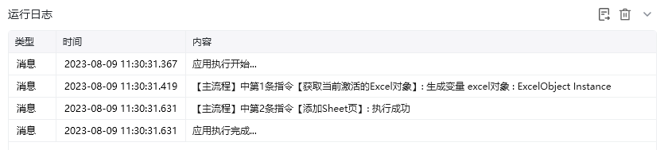

## 指令说明

**描述：** 在Excel工作簿中添加新的工作表。

## 参数说明

<Tabs>
  <Tab title="常规">
    

    | 参数 | 说明 |
    | --- | --- |
    | **Excel对象** | 请选择Excel对象（可通过指令【启动Excel】或【获取当前激活的Excel对象】创建），用于确定待操作的工作簿。 |
    | **Sheet页名称** | 输入新工作表的名称。 |
    | **插入位置** | 选择插入位置：工作簿末尾、当前工作表之前、当前工作表之后。 |
  </Tab>
  <Tab title="高级">
    本指令暂无高级参数。
  </Tab>
</Tabs>

## 使用示例

**该流程执行逻辑：**

使用【启动Excel】打开已有的Excel，并将Excel对象保存到excel对象

使用【添加Sheet页】指令在工作簿中添加新的工作表

### 效果展示

<Info>
  使用指令过程中遇到问题？前往 [八爪鱼RPA 开发者社区问答板块](https://rpa.bazhuayu.com/community/questions) 提问，获取官方与社区帮助。
</Info>
