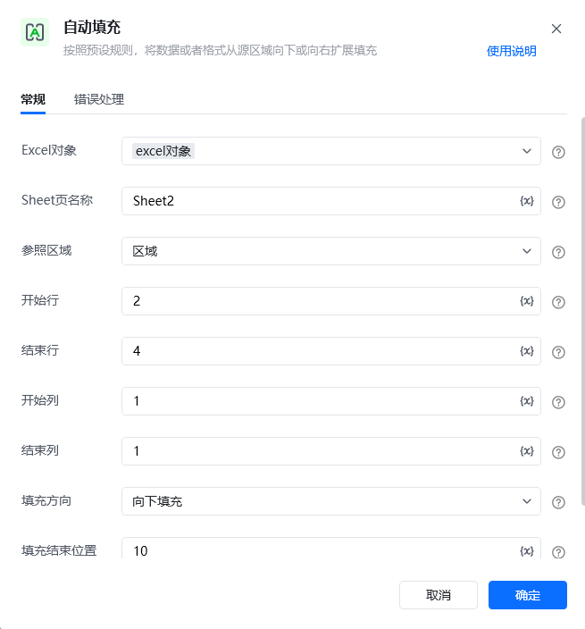
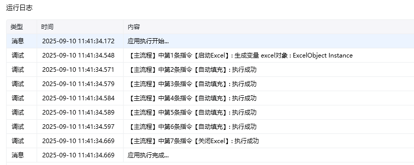
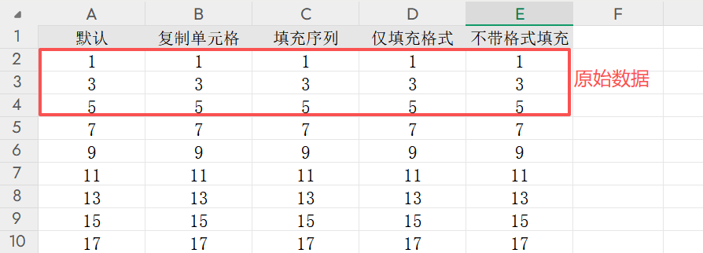

## 指令说明

**描述：** 对Excel表格中指定区域的单元格实现自动填充功能。

## 参数说明

<Tabs>
  <Tab title="常规">
    

    | 参数 | 说明 |
    | --- | --- |
    | **Excel对象** | 请选择Excel对象（可通过指令【启动Excel】或【获取当前激活的Excel对象】创建），用于确定待操作的工作簿。 |
    | **Sheet页名称** | 操作目标工作表的名称，支持选填，默认为当前Excel激活的Sheet页。 |
    | **填充区域** | 选择或填写需要自动填充的单元格区域。 |
    | **数据来源** | 填写自动填充的数据来源（单元格值或公式）。 |
  </Tab>
  <Tab title="高级">
    本指令暂无高级参数。
  </Tab>
</Tabs>

## 使用示例

**该流程执行逻辑：**

使用【启动Excel】打开已有的Excel，并将Excel对象保存到excel对象

使用【自动填充】指令填充指定单元格区域

### 运行结果

<Info>
  使用指令过程中遇到问题？前往 [八爪鱼RPA 开发者社区问答板块](https://rpa.bazhuayu.com/community/questions) 提问，获取官方与社区帮助。
</Info>
