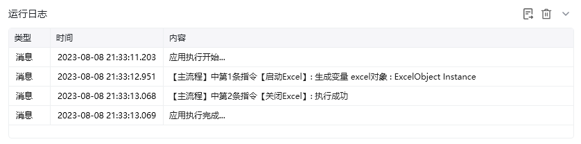

## 指令说明

**描述：** 关闭指定的Excel文件或者所有的Excel文件。

## 参数说明

<Tabs>
  <Tab title="常规">
    

    | 参数 | 说明 |
    | --- | --- |
    | **关闭方式** | 选择关闭方式：关闭指定的Excel文件、关闭所有Excel文件 |
    | **Excel对象** | 选择需要被关闭的Excel对象 |
    | **保存方式** | 选择关闭保存方式：保存、另存为、不保存 |
  </Tab>
  <Tab title="高级">
    本指令暂无高级参数。
  </Tab>
</Tabs>

## 使用示例

**该流程执行逻辑：**

使用【启动Excel】打开已有的Excel，并将Excel对象保存到excel对象

使用【关闭Excel】指令关闭并保存excel对象

### 运行结果

<Info>
  使用指令过程中遇到问题？前往 [八爪鱼RPA 开发者社区问答板块](https://rpa.bazhuayu.com/community/questions) 提问，获取官方与社区帮助。
</Info>
