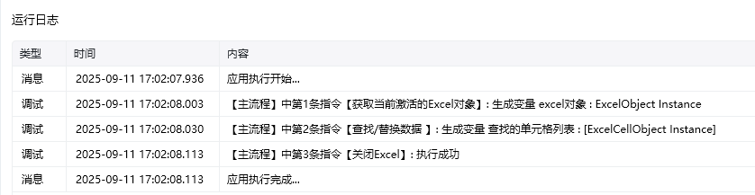
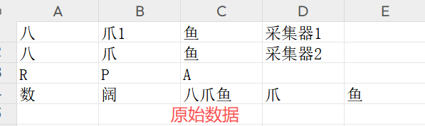
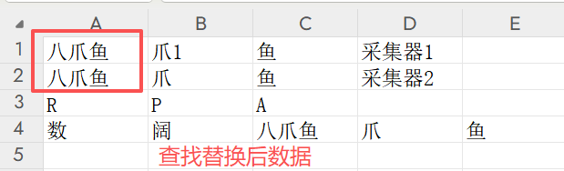

## 指令说明

**描述：** 在Excel工作表中查找或替换指定内容的单元格。

## 参数说明

<Tabs>
  <Tab title="常规">
    

    | 参数 | 说明 |
    | --- | --- |
    | **Excel对象** | 请选择Excel对象（可通过指令【启动Excel】或【获取当前激活的Excel对象】创建），用于确定待操作的工作簿。 |
    | **Sheet页名称** | 操作目标工作表的名称，支持选填，默认为当前Excel激活的Sheet页。 |
    | **操作类型** | 下拉选择：查找、替换 |
    | **查找内容** | 输入要查找的文本。 |
    | **替换内容** | 若选择"替换"，输入替换后的文本。 |
    | **查找范围** | 选择或填写查找的单元格区域。 |
    | **查找选项** | 设置匹配方式：精确匹配、模糊匹配等。 |
    | **保存查找结果至** | 将查找到的单元格位置信息保存到变量。 |
  </Tab>
  <Tab title="高级">
    本指令暂无高级参数。
  </Tab>
</Tabs>

## 使用示例

**该流程执行逻辑：**

使用【获取当前激活的Excel对象】命令获取当前激活的Excel对象，将对象保存到excel对象

使用【查找/替换数据】查找设定区域内的字符并替换

### 运行结果

<Info>
  使用指令过程中遇到问题？前往 [八爪鱼RPA 开发者社区问答板块](https://rpa.bazhuayu.com/community/questions) 提问，获取官方与社区帮助。
</Info>
