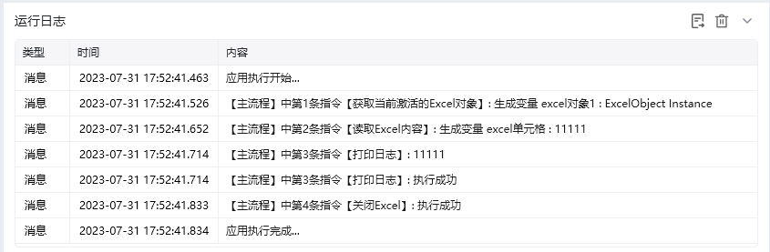

## 指令说明

**描述：** 获取当前激活的Excel文件。

## 参数说明

<Tabs>
  <Tab title="常规">
    

    | 参数 | 说明 |
    | --- | --- |
    | **保存Excel数据对象至** | 保存读取到内容为变量 |
  </Tab>
  <Tab title="高级">
    本指令暂无高级参数。
  </Tab>
</Tabs>

## 使用示例

**该流程执行逻辑：**

使用【获取当前激活的Excel对象】命令获取当前激活的Excel对象，将对象保存到excel对象1

使用【读取Excel内容】指令读取excel对象1中默认Sheet里第1行第1列单元格内容将结果保存到excel单元格

使用【打印日志】指令打印excel单元格消息日志

使用【关闭Excel】指令关闭并保存excel对象

### 运行结果

<Info>
  使用指令过程中遇到问题？前往 [八爪鱼RPA 开发者社区问答板块](https://rpa.bazhuayu.com/community/questions) 提问，获取官方与社区帮助。
</Info>
