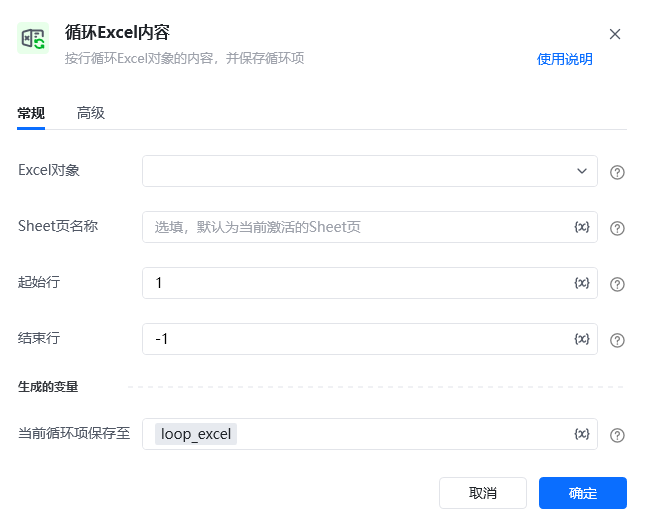
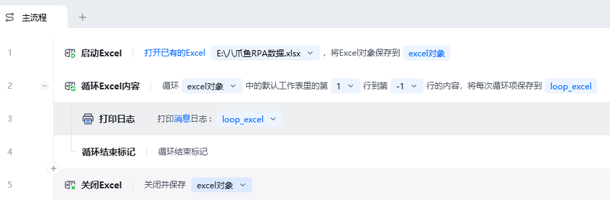
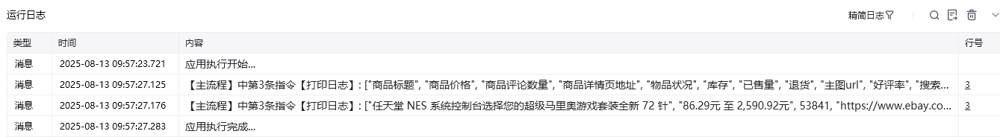

## 指令说明

**描述：** 按行循环Excel对象的内容，并保存循环项。

## 参数说明

<Tabs>
  <Tab title="常规">
    

    | 参数 | 说明 |
    | --- | --- |
    | **Excel对象** | 请选择Excel对象（可通过指令【启动Excel】或【获取当前激活的Excel对象】创建），用于确定待操作的工作簿。 |
    | **Sheet页名称** | 操作目标工作表的名称，支持选填，默认为当前Excel激活的Sheet页。 |
    | **起始行** | 循环的起始行号，第一行从1开始。 |
    | **结束行** | 循环的结束行号，最后一行可用-1表示。 |
  </Tab>
  <Tab title="高级">
    | 参数 | 说明 |
    | --- | --- |
    | **读取单元格显示的内容** | 若勾选，则读取的内容将与Excel中显示的内容一致，且始终以文本的形式返回；若不勾选，则返回的内容将根据数据类型进行转换。 |
  </Tab>
</Tabs>

## 使用示例

**该流程执行逻辑：**

使用【启动Excel】打开已有的Excel，并将Excel对象保存到excel对象

使用【循环Excel内容】指令循环工作表中从第1行到最后1行的内容，并将循环项保存到「loop_excel」变量中

使用【打印日志】打印变量「loop_excel」

使用【关闭Excel】指令关闭并保存excel对象

### 运行结果

<Info>
  使用指令过程中遇到问题？前往 [八爪鱼RPA 开发者社区问答板块](https://rpa.bazhuayu.com/community/questions) 提问，获取官方与社区帮助。
</Info>
