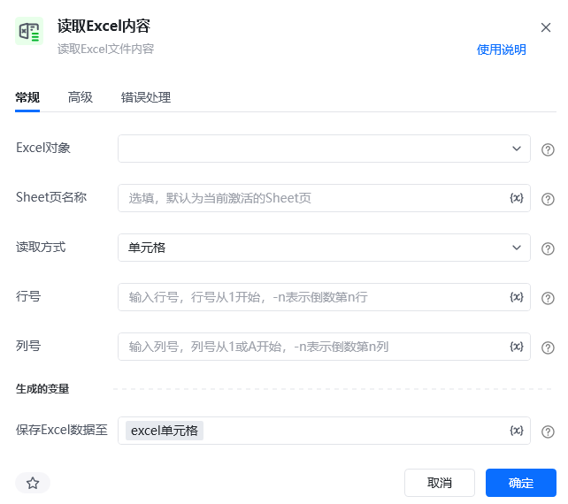
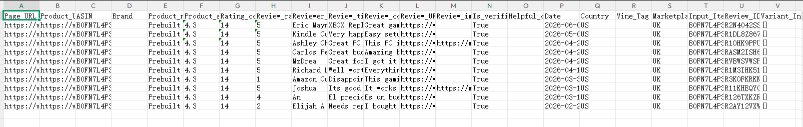
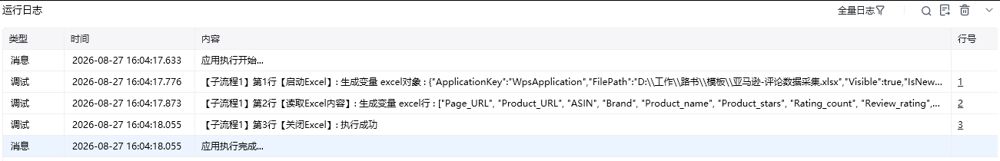
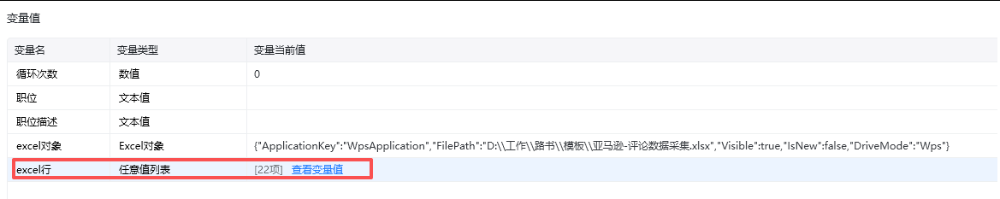

## 指令说明

**描述：** 读取 Excel 工作表中的单元格、行、列或指定区域内容，并保存为流程变量。

## 参数说明

<Tabs>
  <Tab title="常规">
    

    | 参数 | 说明 |
    | --- | --- |
    | **Excel对象** | 请选择 Excel 对象（可通过【启动Excel】或【获取当前激活的Excel对象】创建），用于确定待操作的工作簿。 |
    | **Sheet页名称** | 操作目标工作表的名称，支持选填，默认为当前 Excel 激活的 Sheet 页。 |
    | **读取方式** | 选择需要读取的内容类型：单元格、行、列或区域。 |
    | **其他参数** | 根据读取方式填写对应的行号、列号或区域范围。 |
  </Tab>
  <Tab title="高级">
    

    | 参数 | 说明 |
    | --- | --- |
    | **读取单元格显示的内容** | 勾选后返回与 Excel 显示一致的文本内容；未勾选时，结果会根据数据类型进行转换。 |
  </Tab>
</Tabs>

## 使用示例

**该流程执行逻辑：**

1. 使用【启动Excel】打开目标工作簿并生成 Excel 对象。
2. 执行【读取Excel内容】，选择默认 Sheet，按行读取第 1 行数据。
3. 将读取到的单元格内容保存到结果变量，供后续数据处理或写入操作使用，最后按需要关闭 Excel。

### 效果展示

<Info>
  使用指令过程中遇到问题？前往 [八爪鱼RPA 开发者社区问答板块](https://rpa.bazhuayu.com/community/questions) 提问，获取官方与社区帮助。
</Info>
