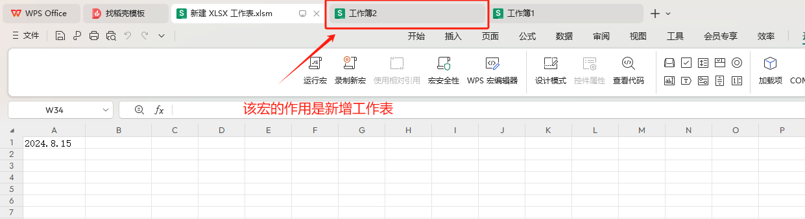

## 指令说明

**描述：** 在Excel文件中执行指定宏命令。

## 参数说明

<Tabs>
  <Tab title="常规">
    

    | 参数 | 说明 |
    | --- | --- |
    | **Excel对象** | 输入一个通过"启动Excel"或"获取当前激活的Excel对象"产生的Excel对象 |
    | **宏名称** | 输入在Excel文件中已存在的宏名称 |
  </Tab>
  <Tab title="高级">
    | 参数 | 说明 |
    | --- | --- |
    | **宏参数** | 输入宏中需要传递的实际参数，可新增多个参数，宏参数为列表类型 |
  </Tab>
</Tabs>

## 使用示例

**该流程执行逻辑：**

使用【启动Excel】打开已有的启用宏的Excel，并将Excel对象保存到excel对象

使用【运行Excel宏】在excel对象中执行名称为Macro1的宏命令

使用【获取当前激活的Excel对象】获取当前激活的Excel对象，将对象保存到excel1

使用【关闭Excel】指令关闭并保存excel1对象

### 运行结果

<Info>
  使用指令过程中遇到问题？前往 [八爪鱼RPA 开发者社区问答板块](https://rpa.bazhuayu.com/community/questions) 提问，获取官方与社区帮助。
</Info>
