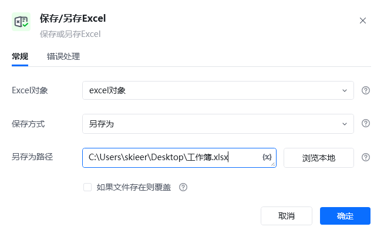
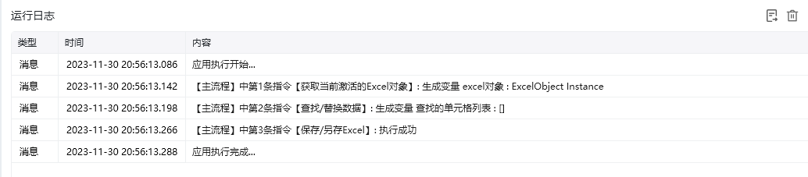

## 指令说明

**描述：** 保存/另存为excel。

## 参数说明

<Tabs>
  <Tab title="常规">
    

    | 参数 | 说明 |
    | --- | --- |
    | **Excel对象** | 新建Excel或选择已打开的Excel对象。 |
    | **保存方式** | 保存/另存为 |
    | **另存为路径** | 若上一参数填写"另存为"，本参数需填写"另存的Excel文件路径" |
    | **如果文件存在则覆盖** | 勾选，如果文件在路径已存在，若勾选，支持直接覆盖。 |
  </Tab>
  <Tab title="高级">
    本指令暂无高级参数。
  </Tab>
</Tabs>

## 使用示例

**该流程执行逻辑：**

使用【获取当前激活的Excel对象】命令获取当前激活的Excel对象，将对象保存到excel对象

使用【查找/替换数据】查找设定区域内的字符"八"，并替换成"八爪鱼"

使用【保存/另存为excel】指令将文件另存到新的路径

### 运行结果

<Info>
  使用指令过程中遇到问题？前往 [八爪鱼RPA 开发者社区问答板块](https://rpa.bazhuayu.com/community/questions) 提问，获取官方与社区帮助。
</Info>
