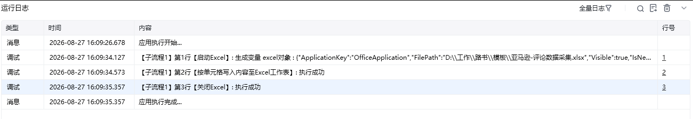
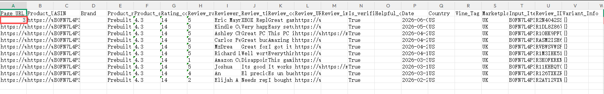

## 指令说明

**描述：** 在 Excel 工作表中按单元格写入内容。

## 参数说明

<Tabs>
  <Tab title="常规">
    

    | 参数 | 说明 |
    | --- | --- |
    | **Excel对象** | 请选择 Excel 对象（可通过【启动Excel】或【获取当前激活的Excel对象】创建），用于确定待操作的工作簿。 |
    | **Sheet页名称** | 操作目标工作表的名称，支持选填，默认为当前 Excel 激活的 Sheet 页。 |
    | **行号** | 输入需要定位的目标行号。 |
    | **列号** | 输入需要定位的目标列号。 |
    | **写入内容** | 输入需要写入或更新的内容。 |
  </Tab>
  <Tab title="高级">
    本指令暂无高级参数。
  </Tab>
</Tabs>

## 使用示例

**该流程执行逻辑：**

1. 使用【启动Excel】或【获取当前激活的Excel对象】连接目标工作簿。
2. 执行【按单元格写入内容至Excel工作表】，选择默认 Sheet，将行号设为 `2`、列号设为 `1`、写入内容设为 `3`。
3. 保存并查看工作簿，确认默认 Sheet 的第 2 行第 1 列已写入 `3`。

### 效果展示

<Info>
  使用指令过程中遇到问题？前往 [八爪鱼RPA 开发者社区问答板块](https://rpa.bazhuayu.com/community/questions) 提问，获取官方与社区帮助。
</Info>
