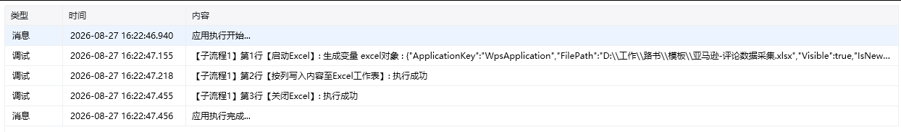
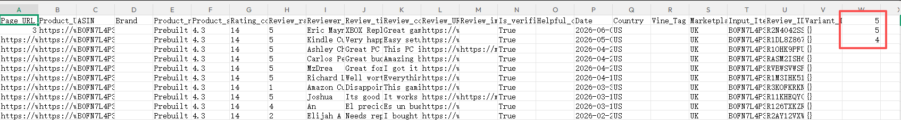

## 指令说明

**描述：** 在 Excel 工作表中按列写入内容。

## 参数说明

<Tabs>
  <Tab title="常规">
    

    | 参数 | 说明 |
    | --- | --- |
    | **Excel对象** | 请选择 Excel 对象（可通过【启动Excel】或【获取当前激活的Excel对象】创建），用于确定待操作的工作簿。 |
    | **Sheet页名称** | 操作目标工作表的名称，支持选填，默认为当前 Excel 激活的 Sheet 页。 |
    | **写入方式** | 设置数据写入方式，可选追加、插入或覆盖。 |
    | **其他输入** | 根据写入方式填写对应的区域或位置。 |
  </Tab>
  <Tab title="高级">
    本指令暂无高级参数。
  </Tab>
</Tabs>

## 使用示例

**该流程执行逻辑：**

1. 使用【启动Excel】连接目标工作簿并生成 Excel 对象。
2. 执行【按列写入内容至Excel工作表】，选择默认 Sheet，将数据 `5, 5, 4` 从指定列的第 1 行开始依次写入。
3. 写入后，目标列的第 1、2、3 行分别显示 `5`、`5`、`4`，最后按需要保存并关闭工作簿。

### 效果展示

<Info>
  使用指令过程中遇到问题？前往 [八爪鱼RPA 开发者社区问答板块](https://rpa.bazhuayu.com/community/questions) 提问，获取官方与社区帮助。
</Info>
