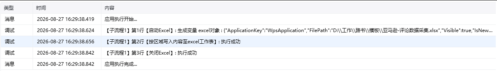
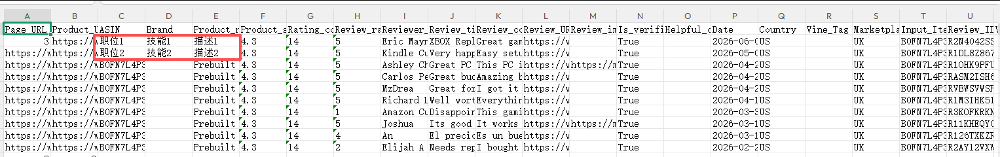

## 指令说明

**描述：** 在 Excel 中写入单个值、列表或数据表格，并按数据量依次填充到指定区域的单元格。

## 参数说明

<Tabs>
  <Tab title="常规">
    

    | 参数 | 说明 |
    | --- | --- |
    | **Excel对象** | 请选择 Excel 对象（可通过【启动Excel】或【获取当前激活的Excel对象】创建），用于确定待操作的工作簿。 |
    | **Sheet页名称** | 操作目标工作表的名称，支持选填，默认为当前 Excel 激活的 Sheet 页。 |
    | **开始行** | 输入目标区域开始的行号。 |
    | **开始列** | 输入目标区域开始的列号。 |
    | **写入内容** | 选择变量；可选择列表、数据表格，或直接输入内容。 |
  </Tab>
  <Tab title="高级">
    本指令暂无高级参数。
  </Tab>
</Tabs>

## 使用示例

**该流程执行逻辑：**

1. 使用【启动Excel】或【获取当前激活的Excel对象】连接目标工作簿，并准备待写入的数据表格。
2. 执行【按区域写入内容至Excel工作表】，选择默认 Sheet，将起始位置设为第 `2` 行、第 `3` 列。
3. 保存并查看工作簿，确认数据表格已从默认 Sheet 的第 2 行第 3 列开始按区域写入。

### 效果展示

<Info>
  使用指令过程中遇到问题？前往 [八爪鱼RPA 开发者社区问答板块](https://rpa.bazhuayu.com/community/questions) 提问，获取官方与社区帮助。
</Info>
