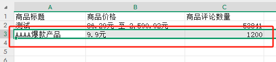

## 指令说明

**描述：** 在Excel工作表中按行写入内容，支持追加、插入或覆盖。

## 参数说明

<Tabs>
  <Tab title="常规">
    

    | 参数 | 说明 |
    | --- | --- |
    | **Excel对象** | 请选择Excel对象（可通过指令【启动Excel】或【获取当前激活的Excel对象】创建），用于确定待操作的工作簿。 |
    | **Sheet页名称** | 所在工作表名称，选填，默认为当前激活的Sheet页。 |
    | **写入方式** | 下拉选择：追加一行（在最后一行追加）、插入一行（需填写行号）、覆盖一行（需填写行号）。 |
    | **行号** | 行号从1开始，-n表示倒数第n行。 |
    | **输入方式** | 顺序行写入/指定列写入。 |
    | **起始列号** | 列号从1或A开始，-n表示倒数第n列。 |
    | **写入内容** | 输入要写入的内容。 |
  </Tab>
  <Tab title="高级">
    本指令暂无高级参数。
  </Tab>
</Tabs>

## 使用示例

**该流程执行逻辑：**

使用【启动Excel】打开已有的Excel，并将Excel对象保存到excel对象

使用【按行写入内容至Excel工作表】指令对默认Sheet页进行追加一行，按「指定列写入」写入内容

### 运行结果

<Info>
  使用指令过程中遇到问题？前往 [八爪鱼RPA 开发者社区问答板块](https://rpa.bazhuayu.com/community/questions) 提问，获取官方与社区帮助。
</Info>
