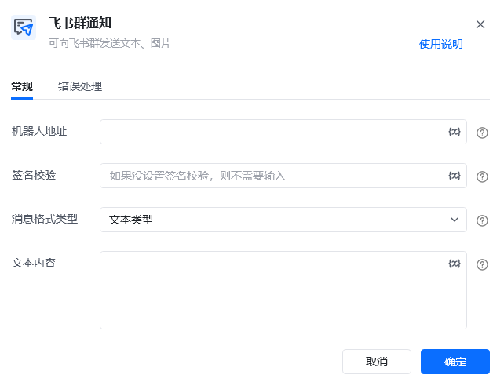
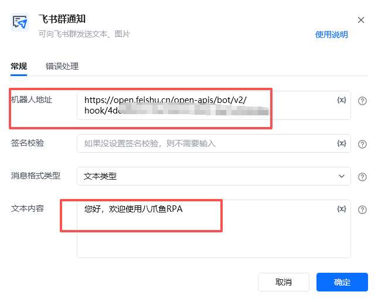
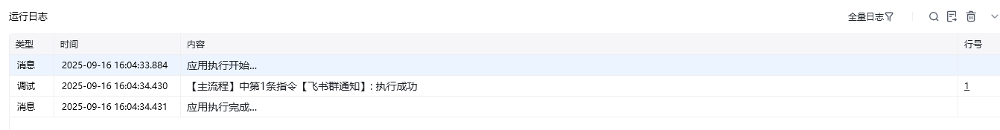

## 指令说明

**描述：** 通过飞书群机器人 Webhook 向指定群聊发送文本或图片通知，用于流程结果、异常和进度提醒。

## 参数说明

<Tabs>
  <Tab title="常规">
    

    | 参数 | 说明 |
    | --- | --- |
    | **机器人地址** | 机器人的网络地址，即webhook，需要自行申请 |
    | **签名校验** | 机器人安全设置中的签名校验，如果没设置签名校验，则不需要输入 |
    | **消息格式类型** | 消息类型及数据格式 |
    | **文本内容** | 输入发送的文本内容 |
  </Tab>
  <Tab title="高级">
    本指令暂无高级参数。
  </Tab>
</Tabs>

## 使用示例

**该流程执行逻辑：**

本例演示【飞书群通知】指令的配置与执行：

1. 填写飞书群机器人的地址和签名校验信息。
2. 设置消息格式和文本内容，将通知发送到对应飞书群。

### 效果展示

<Info>
  使用指令过程中遇到问题？前往 [八爪鱼RPA 开发者社区问答板块](https://rpa.bazhuayu.com/community/questions) 提问，获取官方与社区帮助。
</Info>
