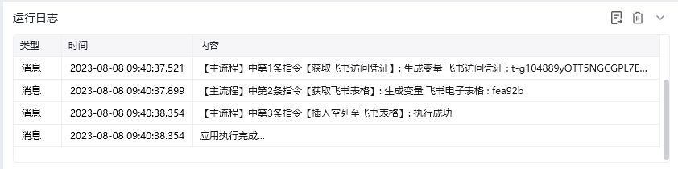
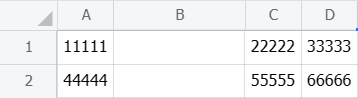
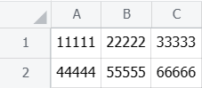

## 指令说明

**描述：** 往飞书电子表格的指定位置后添加空列

## 参数说明

<Tabs>
  <Tab title="常规">
    

    | 参数 | 说明 |
    | --- | --- |
    | **飞书电子表格** | 选择需要添加列的飞书电子表格 |
    | **插入方式** | 下拉选择插入表格的方式，在指定列左侧/右侧插入 |
    | **插入列位置** | 输入列号，列号从1或A开始 |
    | **插入列数** | 输入要添加列的数量 |
  </Tab>
  <Tab title="高级">
    本指令暂无高级参数。
  </Tab>
</Tabs>

## 使用示例

**该流程执行逻辑：**

使用【获取飞书访问凭证】获取飞书访问凭证，并将其保存至飞书访问凭证中

使用【获取飞书表格】根据网址获取飞书表格，并将结果保存至飞书电子表格中

使用【插入空列至飞书表格】往飞书电子表格的第1列右方添加1列空列

### 运行结果

<Info>
  使用指令过程中遇到问题？前往 [八爪鱼RPA 开发者社区问答板块](https://rpa.bazhuayu.com/community/questions) 提问，获取官方与社区帮助。
</Info>
