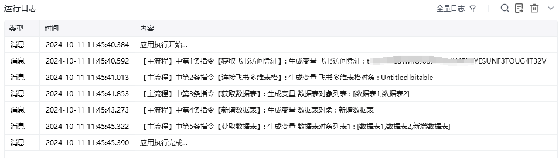

## 指令说明

**描述：** 新增一个空的数据表，也可以指定一些初始字段

## 参数说明

<Tabs>
  <Tab title="常规">

    

    | 参数 | 说明 |
    | --- | --- |
    | **多维表格对象** | 请选择通过“连接飞书多维表格”指令产生的多维表格对象 |
    | **数据表名称** | 填写新增的数据表名称，名称会自动移除首尾的空格 |
    | **默认视图名称** | 非必填，默认表格视图的名称，会自动移除名称中的首尾空格，不埴则默认为“表格” |
    | **初始字段** | 非必填，可点击添加按钮，填写字段的名称和字段的类型 |
  </Tab>
  <Tab title="高级">
    本指令暂无高级参数。
  </Tab>
</Tabs>

## 使用示例

**该流程执行逻辑：**

使用【获取飞书访问凭证】获取飞书访问凭证，并将其保存至飞书访问凭证中

使用【连接飞书多维表格】根据网址连接到指定的飞书多维表格

使用【获取数据表】获取该多维表格下的所有数据表：案例中目前只有 数据表1和数据表2

使用【新增数据表】新增一个名称为“新增数据表”的数据表

使用【获取数据表】再次获取该多维表格下的所有数据表：数据表1，数据表2和新增数据表，发现“新增数据表”新增成功

### 效果展示

<Info>
  使用指令过程中遇到问题？前往 [八爪鱼RPA 开发者社区问答板块](https://rpa.bazhuayu.com/community/questions) 提问，获取官方与社区帮助。
</Info>
