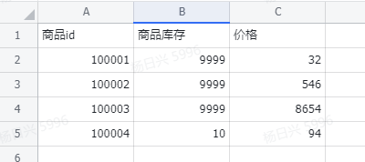
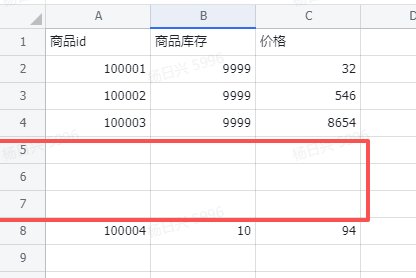

## 指令说明

**描述：** 往飞书电子表格的指定位置插入空行

## 参数说明

<Tabs>
  <Tab title="常规">
    

    | 参数 | 说明 |
    | --- | --- |
    | **飞书电子表格** | 选择需要添加行的飞书电子表格 |
    | **插入方式** | 选择插入新行的方式，在指定行上方或者下方插入 |
    | **插入行位置** | 输入行号，行号从1开始 |
    | **插入行数** | 指定需要添加的行的数量 |
  </Tab>
  <Tab title="高级">
    本指令暂无高级参数。
  </Tab>
</Tabs>

## 使用示例

**该流程执行逻辑：**

### 运行结果

<Info>
  使用指令过程中遇到问题？前往 [八爪鱼RPA 开发者社区问答板块](https://rpa.bazhuayu.com/community/questions) 提问，获取官方与社区帮助。
</Info>
