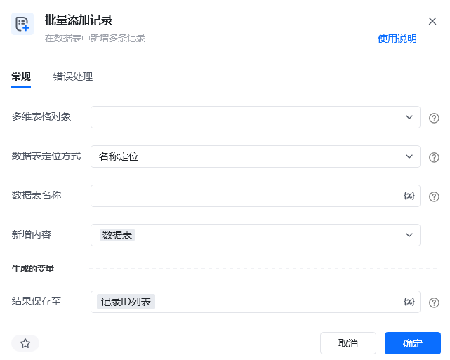
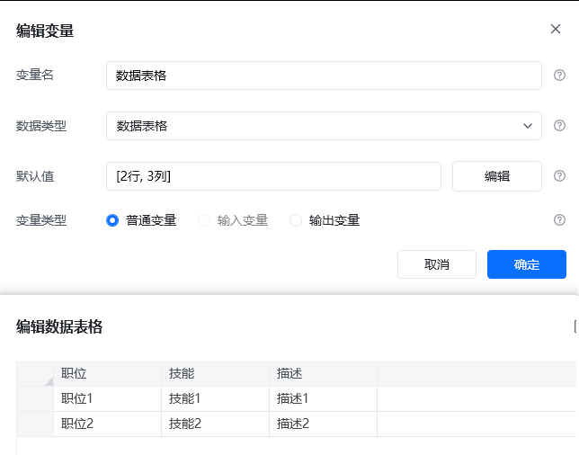
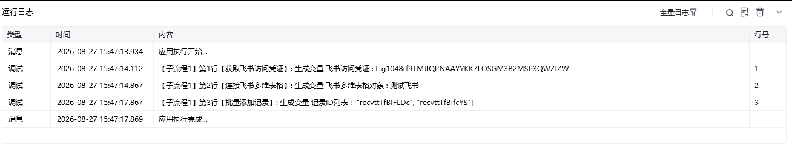
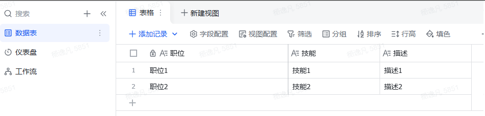

## 指令说明

**描述：** 在飞书多维数据表中新增多条记录。

## 参数说明

<Tabs>
  <Tab title="常规">
    

    | 参数 | 说明 |
    | --- | --- |
    | **多维表格对象** | 请选择通过【连接飞书多维表格】指令产生的多维表格对象。 |
    | **数据表定位方式** | 选择通过名称或 ID 定位待操作的数据表。 |
    | **数据表名称** | 当定位方式选择“名称”时，输入待操作的数据表名称。 |
    | **新增内容** | 输入存放待新增记录的数据表格变量。 |
  </Tab>
  <Tab title="高级">
    本指令暂无高级参数。
  </Tab>
</Tabs>

## 使用示例

**该流程执行逻辑：**

1. 获取飞书访问凭证，并连接需要写入的飞书多维表格。
2. 准备字段结构与目标数据表一致的数据表格对象。
3. 执行【批量添加记录】，选择目标数据表并传入待新增内容。
4. 运行后，数据表格中的多行数据批量生成飞书记录，可在目标数据表中核对新增结果。

### 效果展示

<Info>
  使用指令过程中遇到问题？前往 [八爪鱼RPA 开发者社区问答板块](https://rpa.bazhuayu.com/community/questions) 提问，获取官方与社区帮助。
</Info>
