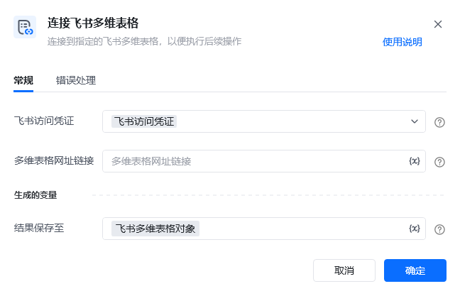

## 指令说明

**描述：** 连接指定的飞书多维表格，以便执行后续操作

## 参数说明

<Tabs>
  <Tab title="常规">
    

    | 参数 | 说明 |
    | --- | --- |
    | **飞书访问凭证** | 设置飞书访问凭证，以获得数据表访问权限 |
    | **多维表格网址链接** | 输入飞书多维表格的URL，可在浏览器里打开对应的电子表格，复制浏览器的地址栏URL |
  </Tab>
  <Tab title="高级">
    本指令暂无高级参数。
  </Tab>
</Tabs>

## 使用示例

**该流程执行逻辑：**

<Info>
  使用指令过程中遇到问题？前往 [八爪鱼RPA 开发者社区问答板块](https://rpa.bazhuayu.com/community/questions) 提问，获取官方与社区帮助。
</Info>
