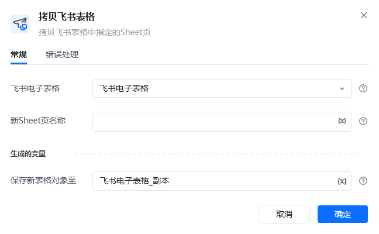
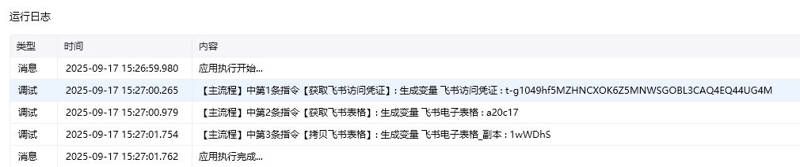
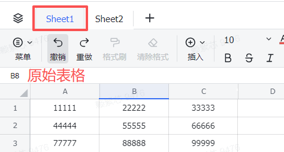
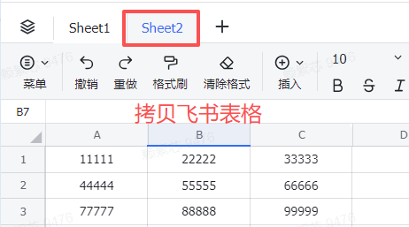

## 指令说明

**描述：** 拷贝飞书表格中指定的Sheet页

## 参数说明

<Tabs>
  <Tab title="常规">
    

    | 参数 | 说明 |
    | --- | --- |
    | **飞书电子表格** | 选择需要读取的飞书电子表格 |
    | **新Sheet页名称** | 输入新飞书电子表格Sheet页的名称（未存在的Sheet页名称） |
    | **生成的变量** | 保存新表格对象变量 |
  </Tab>
  <Tab title="高级">
    本指令暂无高级参数。
  </Tab>
</Tabs>

## 使用示例

**该流程执行逻辑：**

1. 获取飞书访问凭证，并将授权结果保存到“飞书访问凭证”。
2. 根据表格网址获取目标飞书表格，并将表格对象保存到“飞书电子表格”。
3. 执行【拷贝飞书表格】，复制指定 Sheet，并将新 Sheet 命名为 `Sheet2`。
4. 将复制后的表格对象保存到“飞书电子表格_副本”，可通过运行前、运行后截图确认新增的 Sheet。

### 效果展示

<Info>
  使用指令过程中遇到问题？前往 [八爪鱼RPA 开发者社区问答板块](https://rpa.bazhuayu.com/community/questions) 提问，获取官方与社区帮助。
</Info>
