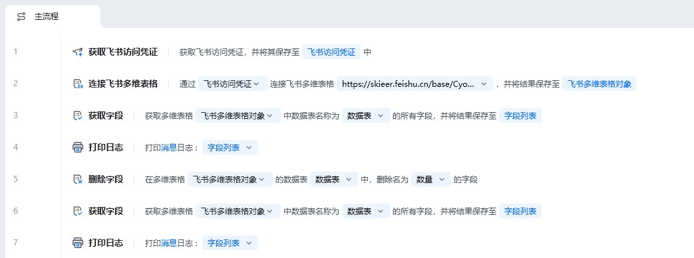
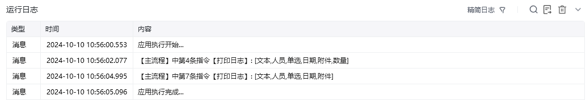
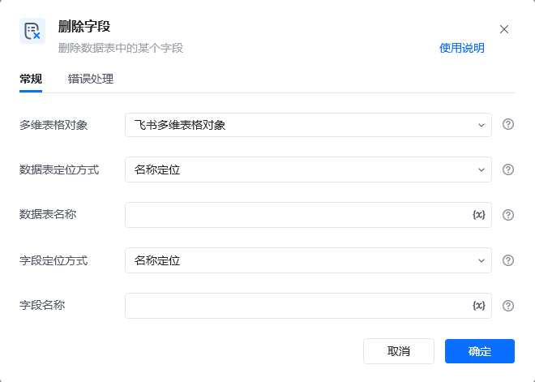
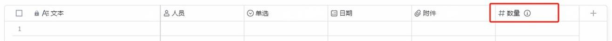
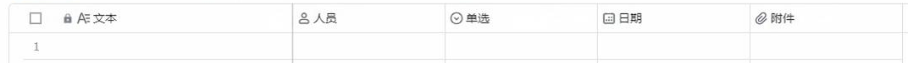

## 指令说明

**描述：** 删除指定数据表中的某个字段

## 参数说明

<Tabs>
  <Tab title="常规">
    

    | 参数 | 说明 |
    | --- | --- |
    | **多维表格对象** | 请选择通过“连接飞书多维表格”指令产生的多维表格对象 |
    | **数据表定位方式** | 选择定位方式，可以通过“名称定位”或“ID定位”来指定待操作的数据表 |
    | **数据表名称** | 请输入要删除字段的数据表名称（数据表定位方式选择名称定位时） |
    | **数据表ID** | 请输入要删除字段的数据表ID（数据表定位方式选择ID定位时） |
    | **字段定位方式** | 选择定位方式，可以通过名称定位或ID定位来指定待操作的字段 |
    | **字段名称** | 请输入要待操作的字段名称（字段定位方式选择名称定位时） |
    | **字段ID** | 请输入要待操作的字段ID（字段定位方式选择ID定位时） |
  </Tab>
  <Tab title="高级">
    本指令暂无高级参数。
  </Tab>
</Tabs>

## 使用示例

**该流程执行逻辑：**

使用【获取飞书访问凭证】获取飞书访问凭证，并将其保存至飞书访问凭证中

使用【连接飞书多维表格】连接到指定的飞书多维表格，并将其保存至飞书多维表格对象中

使用【获取字段】用名称定位的方式获取飞书多维表格对象指定数据表中的所有字段，并将其保存至字段列表中

使用【打印日志】将原始的字段列表打印输出，输出内容可在[运行日志]区查看

使用【删除字段】在数据表中删除一个字段，字段名称为数量

使用【获取字段】用名称定位的方式获取飞书多维表格对象指定数据表中的所有字段，并将其保存至字段列表中

使用【打印日志】将删除字段后的字段列表打印输出，输出内容可在[运行日志]区查看

### 运行结果

<Info>
  使用指令过程中遇到问题？前往 [八爪鱼RPA 开发者社区问答板块](https://rpa.bazhuayu.com/community/questions) 提问，获取官方与社区帮助。
</Info>
