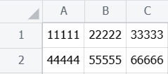

## 指令说明

**描述：** 从飞书表格里查找指定内容所在的单元格，返回单元格的坐标

## 参数说明

<Tabs>
  <Tab title="常规">
    

    | 参数 | 说明 |
    | --- | --- |
    | **飞书表格** | 选择需要读取的飞书表格 |
    | **查找的内容** | 设置需要查找的内容，是否忽略大小写，是否完全匹配整个单元格，是否为正则匹配 |
    | **生成的变量** | 保存单元变量 |
  </Tab>
  <Tab title="高级">
    本指令暂无高级参数。
  </Tab>
</Tabs>

## 使用示例

**该流程执行逻辑：**

使用【获取飞书访问凭证】获取飞书访问凭证，并将其保存至飞书访问凭证中

使用【获取飞书表格】根据网址获取飞书表格，并将结果保存至飞书表格中

使用【查找飞书单元格】在飞书电子表格中查找“A”所在的单元格，不区分大小写，将结果保存到单元格列表

使用【打印日志】打印单元格列表[0]的消息日志

### 运行结果

<Info>
  使用指令过程中遇到问题？前往 [八爪鱼RPA 开发者社区问答板块](https://rpa.bazhuayu.com/community/questions) 提问，获取官方与社区帮助。
</Info>
