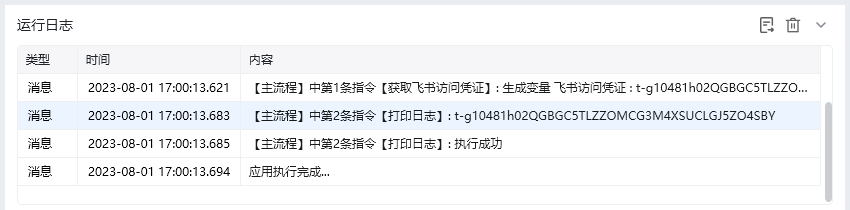
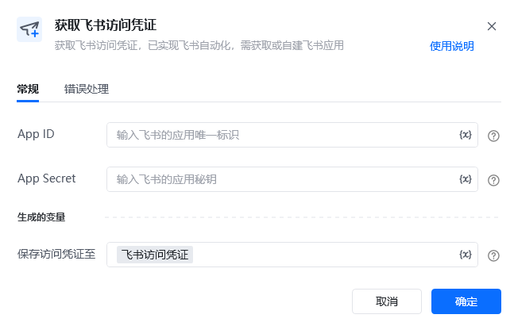

## 指令说明

**描述：** 获取飞书访问凭证，已实现飞书自动化，需获取或自建飞书应用

## 参数说明

<Tabs>
  <Tab title="常规">
    

    | 参数 | 说明 |
    | --- | --- |
    | **App ID** | 输入飞书的应用唯一标识，在飞书开发者后台打开应用的详情页，并在“凭证与基础信息“页面获取 |
    | **App Secret** | 输入飞书的应用密钥，在飞书开发者后台打开应用的详情页，并在“凭证与基础信息“页面获取 |
  </Tab>
  <Tab title="高级">
    本指令暂无高级参数。
  </Tab>
</Tabs>

## 使用示例

**该流程执行逻辑：**

使用【获取飞书访问凭证】获取飞书访问凭证，并将其保存至飞书访问凭证中；

使用【打印日志】打印飞书访问凭证消息日志。

### 效果展示

<Info>
  使用指令过程中遇到问题？前往 [八爪鱼RPA 开发者社区问答板块](https://rpa.bazhuayu.com/community/questions) 提问，获取官方与社区帮助。
</Info>
