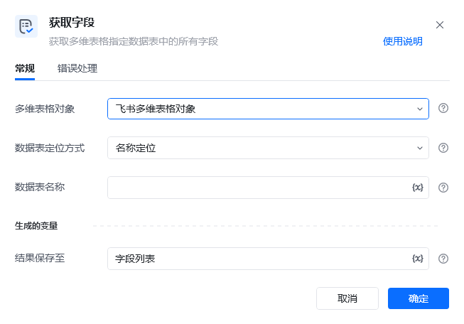
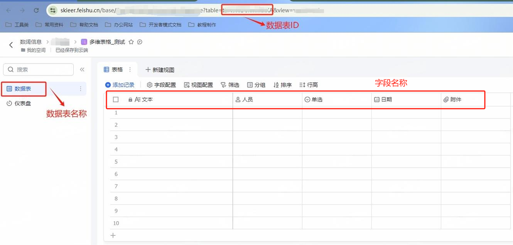
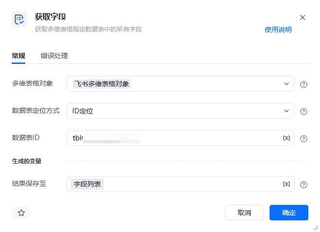
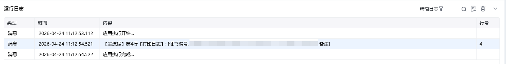

## 指令说明

**描述：** 获取多维表格指定数据表中所有字段的名称

## 参数说明

<Tabs>
  <Tab title="常规">
    

    | 参数 | 说明 |
    | --- | --- |
    | **多维表格对象** | 请选择通过【连接飞书多维表格】指令产生的多维表格对象 |
    | **数据表定位方式** | 输入需要打开的网址。如果是打开单个网页，直接输入网址即可，或者传输进去一个网址参数。 |
    | **数据表名称** | 请输入要获取字段的数据表名称（数据表定位方式选择名称定位时） |
    | **数据表ID** | 请输入要获取字段的数据表ID（数据表定位方式选择ID定位时） |
  </Tab>
  <Tab title="高级">
    本指令暂无高级参数。
  </Tab>
</Tabs>

## 使用示例

**该流程执行逻辑：**

此流程运行逻辑：

获取飞书访问凭证 ---> 连接到指定的飞书多维表格 ---> 使用【获取字段】用数据表ID定位的方式获取飞书多维表格对象指定数据表中的所有字段名称，并将其保存至字段列表中 ---> 将字段列表打印到控制台

### 效果展示

<Info>
  使用指令过程中遇到问题？前往 [八爪鱼RPA 开发者社区问答板块](https://rpa.bazhuayu.com/community/questions) 提问，获取官方与社区帮助。
</Info>
