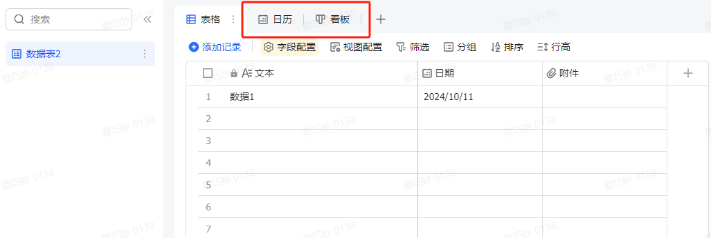
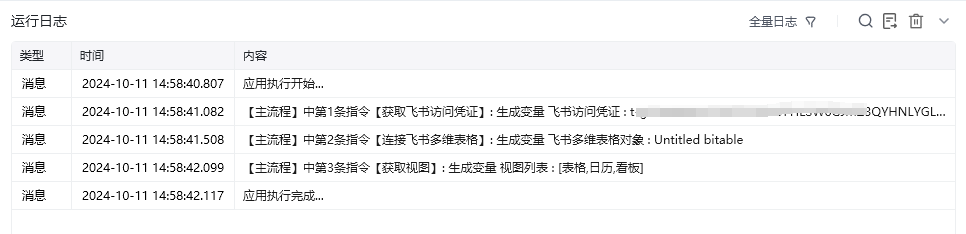
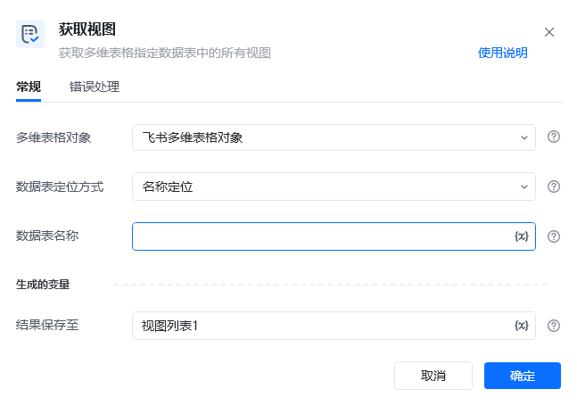

## 指令说明

**描述：** 获取多维表格指定数据表中的所有视图

## 参数说明

<Tabs>
  <Tab title="常规">
    

    | 参数 | 说明 |
    | --- | --- |
    | **多维表格对象** | 选择通过“连接飞书多维表格“指令产生的多维表格对象 |
    | **数据表定位方式** | 选择定位方式，可以通过名称或ID来指定待操作的数据表 |
    | **数据表ID** | 请输入要删除的数据表ID |
    | **数据表名称** | 请输入要获取视图的数据表名称 |
  </Tab>
  <Tab title="高级">
    本指令暂无高级参数。
  </Tab>
</Tabs>

## 使用示例

**该流程执行逻辑：**

使用【获取飞书访问凭证】获取飞书访问凭证，并将其保存至飞书访问凭证中

使用【连接飞书多维表格】根据网址连接到指定的飞书多维表格

使用【获取视图】获取该多维表格下的数据表2的所有视图，即如图的日历和看板

### 运行结果

<Info>
  使用指令过程中遇到问题？前往 [八爪鱼RPA 开发者社区问答板块](https://rpa.bazhuayu.com/community/questions) 提问，获取官方与社区帮助。
</Info>
