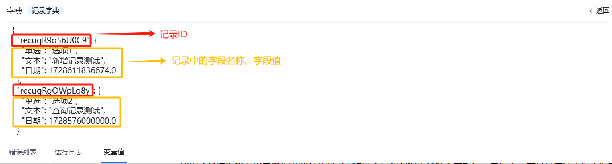
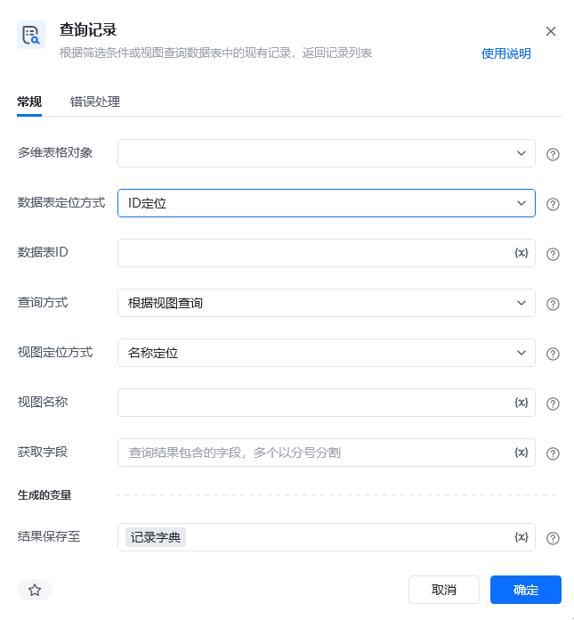

## 指令说明

**描述：** 根据筛选条件或视图查询数据表中的现有记录，并返回记录列表

## 参数说明

<Tabs>
  <Tab title="常规">
    

    | 参数 | 说明 |
    | --- | --- |
    | **多维表格对象** | 选择通过“连接飞书多维表格”指令产生的多维表格对象 |
    | **数据表定位方式** | 选择定位方式，可以通过名称定位或ID定位来指定待操作的数据表 |
    | **数据表名称** | 请输入要查询记录的数据表名称（数据表定位方式选择名称定位时） |
    | **数据表ID** | 请输入要查询记录的数据表ID（数据表定位方式选择ID定位时） |
    | **查询方式** | 请选择查询条件，可选择根据视图查询或根据筛选条件查询。 根据视图查询：获取指定视图下的记录；、 根据筛选条件查询：忽略视图，在数据表中根据条件查询现有的记录 |
    | **视图定位方式** | 选择定位方式，可以通过名称定位或ID定位来指定待操作的视图（查询方式选择视图查询时） |
    | **视图名称** | 请输入要查询记录的视图名称（查询方式选择视图查询，视图定位方式选择名称定位时） |
    | **视图ID** | 请输入要查询记录的视图ID（查询方式选择视图查询，视图定位方式选择ID定位时） |
    | **筛选公式** | 请输入对应的筛选公式，表达式的语法为: CurrentValue.[字段名] 详情请参考飞书官方文档：记录筛选的指南 |
    | **获取字段** | 请输入本次查询返回记录中需要包含的字段，多字段之间用分号隔开，例：字段1;字段2 |
  </Tab>
  <Tab title="高级">
    本指令暂无高级参数。
  </Tab>
</Tabs>

## 使用示例

**该流程执行逻辑：**

使用【获取飞书访问凭证】获取飞书访问凭证，并将其保存至飞书访问凭证中

使用【连接飞书多维表格】连接到指定的飞书多维表格，并将其保存至飞书多维表格对象中

使用【查询记录】根据视图名称查询数据表中的现有记录，并将返回的记录列表保存在记录字典中，记录字典中包含每条记录的记录ID、字段名称和字段值

### 效果展示

<Info>
  使用指令过程中遇到问题？前往 [八爪鱼RPA 开发者社区问答板块](https://rpa.bazhuayu.com/community/questions) 提问，获取官方与社区帮助。
</Info>
