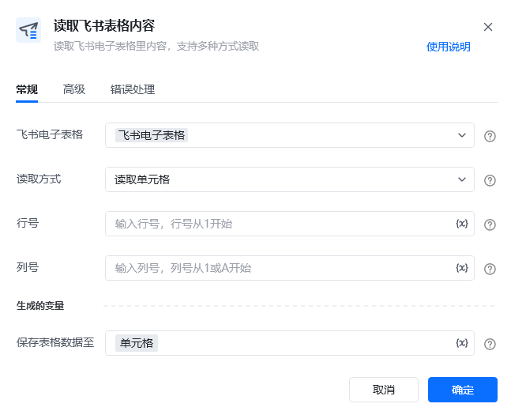
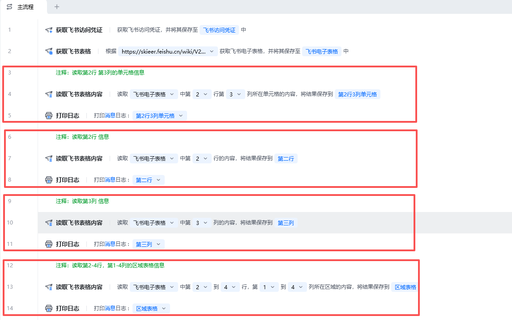
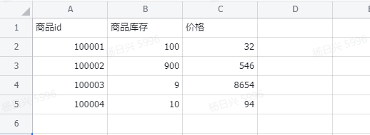
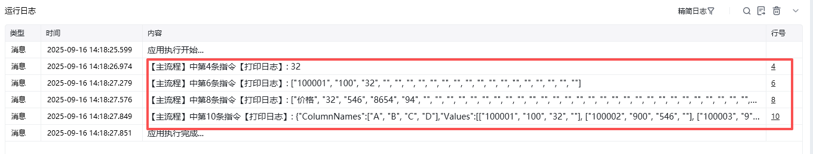

## 指令说明

**描述：**读取飞书电子表格里内容，支持多种方式读取

## 参数说明

<Tabs>
  <Tab title="常规">
    

    | 参数 | 说明 |
    | --- | --- |
    | **飞书电子表格** | 选择需要读取的飞书电子表格 |
    | **读取方式** | 读取单元格：返回文本值、 读取一行：返回列表值、 读取一列：返回列表值、 读取区域：返回表格值，数据表格类型 |
    | **行号** | 输入行号，行号从1开始 |
    | **列号** | 输入列号，列号从1开始 |
    | **开始行** | 输入行号，行号从1开始 |
    | **结束行** | 输入行号，行号从1开始 |
    | **开始列** | 输入列号，列号从1开始 |
    | **结束列** | 输入列号，列号从1开始 |
  </Tab>
  <Tab title="高级">
    

| 参数 | 说明 |
| --- | --- |
| **读取格式** | 返回纯文本的值（数值类型除外） 、 单元格中含有公式时，返回公式本身 、 返回计算结果（保留单元格格式）：返回带格式的计算结果，如货币格式、保留位数等 、 返回计算结果（不保留单元格格式）：返回不带格式的计算结果 |
| **保存表格数据至** | 设置输出变量名称，保存读取到的表格内容。输出变量类型分别是: 文本值(读取单元格)、 文本列表(读取一行/读取一列)、 数据表格(读取区域) |
  </Tab>
</Tabs>

## 使用示例

**该流程执行逻辑：**

### 运行结果

<Info>
  使用指令过程中遇到问题？前往 [八爪鱼RPA 开发者社区问答板块](https://rpa.bazhuayu.com/community/questions) 提问，获取官方与社区帮助。
</Info>
