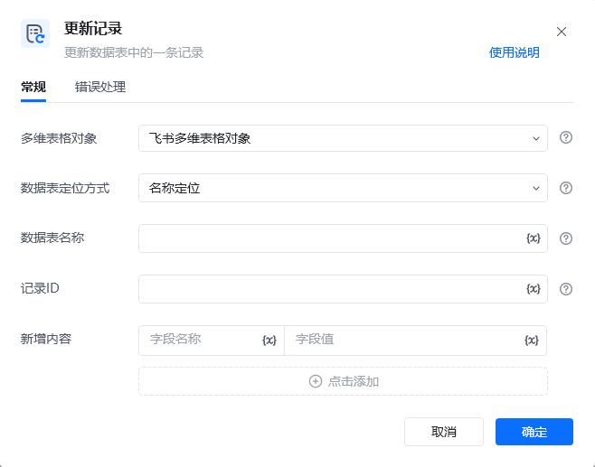
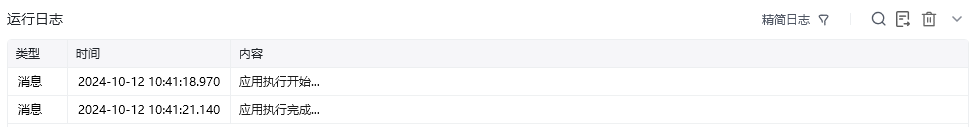

## 指令说明

**描述：** 更新数据表中的一条记录，可更新记录的多个字段值

## 参数说明

<Tabs>
  <Tab title="常规">
    

    | 参数 | 说明 |
    | --- | --- |
    | **多维表格对象** | 请选择通过“连接飞书多维表格”指令产生的多维表格对象 |
    | **数据表定位方式** | 选择定位方式，可以通过名称定位或ID定位来指定待操作的数据表 |
    | **数据表名称** | 请输入要更新记录的数据表名称（数据表定位方式选择名称定位时） |
    | **数据表ID** | 请输入要更新记录的数据表ID（数据表定位方式选择ID定位时） |
    | **记录ID** | 请输入要更新的记录的ID（可先通过查询记录指令获取所有记录的ID） |
    | **新增内容** | 请输入要更新记录中的相应字段名称和更新后的字段值 |
  </Tab>
  <Tab title="高级">
    本指令暂无高级参数。
  </Tab>
</Tabs>

## 使用示例

**该流程执行逻辑：**

使用【获取飞书访问凭证】获取飞书访问凭证，并将其保存至飞书访问凭证中

使用【连接飞书多维表格】连接到指定的飞书多维表格，并将其保存至飞书多维表格对象中

使用【更新记录】根据视图名称更新数据表中的现有记录，通过记录ID指定记录，将制定记录文本字段更新为“更新记录测试_新”

### 运行结果

<Info>
  使用指令过程中遇到问题？前往 [八爪鱼RPA 开发者社区问答板块](https://rpa.bazhuayu.com/community/questions) 提问，获取官方与社区帮助。
</Info>
