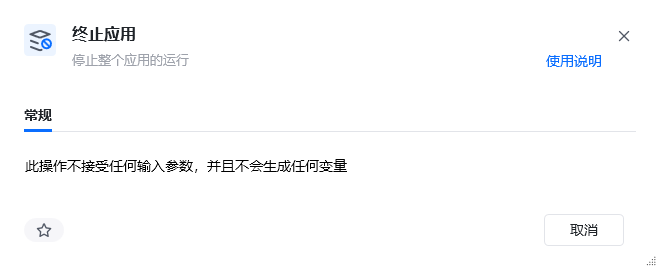
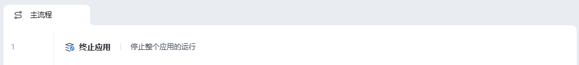
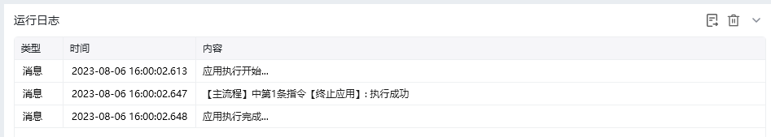

## 指令说明

**描述：** 停止整个应用的运行。

## 参数说明

<Tabs>
  <Tab title="常规">
    

    本指令无参数，直接使用即可终止整个应用。
  </Tab>
  <Tab title="高级">
    本指令暂无高级参数。
  </Tab>
</Tabs>

## 使用示例

**该流程执行逻辑：**

使用【终止应用】停止整个应用的运行

### 运行结果

<Info>
  使用指令过程中遇到问题？前往 [八爪鱼RPA 开发者社区问答板块](https://rpa.bazhuayu.com/community/questions) 提问，获取官方与社区帮助。
</Info>
