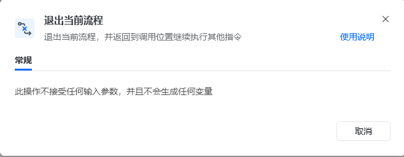
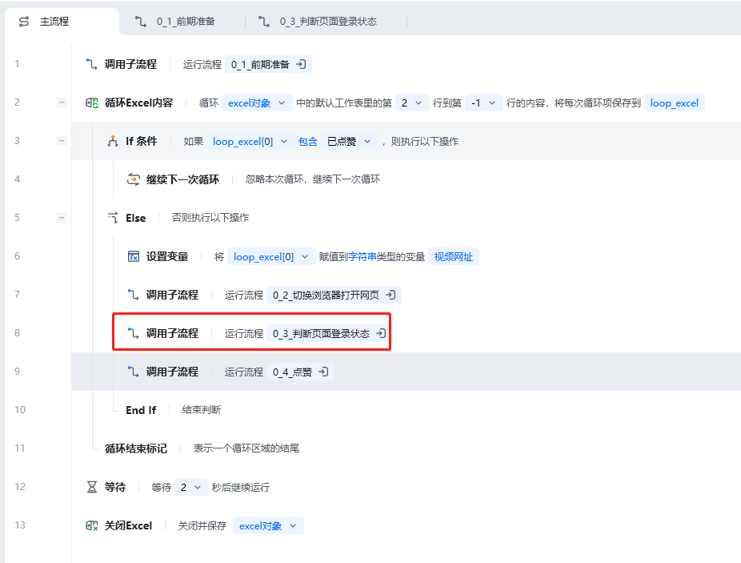
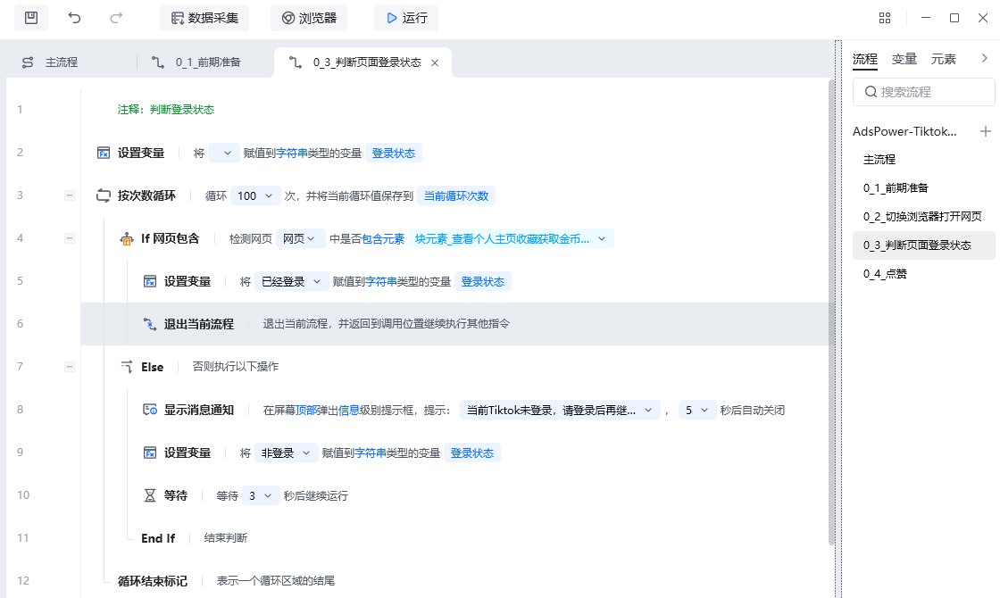

## 指令说明

**描述：** 退出当前流程，并返回到调用位置继续执行其他指令。如退出某个子流程。

## 参数说明

<Tabs>
  <Tab title="常规">
    

    本指令无参数，直接使用即可退出当前子流程。
  </Tab>
  <Tab title="高级">
    本指令暂无高级参数。
  </Tab>
</Tabs>

## 使用示例

**该流程执行逻辑：**

当应用执行到子流程「0_3_判断页面登录状态」的第6步时，使用【退出当前流程】退出整个子流程的运行

回到主流程中继续运行子流程「0_3_判断页面登录状态」后面的指令

### 效果展示

<Info>
  使用指令过程中遇到问题？前往 [八爪鱼RPA 开发者社区问答板块](https://rpa.bazhuayu.com/community/questions) 提问，获取官方与社区帮助。
</Info>
