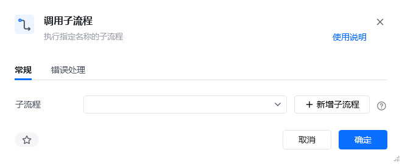
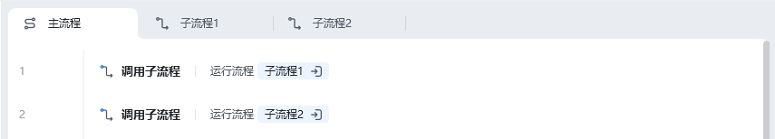
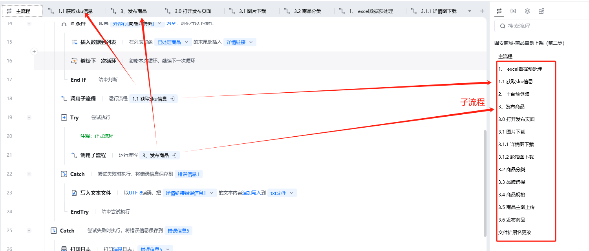

## 指令说明

**描述：** 在指令位置开始，执行指定名称的子流程。

## 参数说明

<Tabs>
  <Tab title="常规">
    

    | 参数 | 说明 |
    | --- | --- |
    | **子流程** | 选择要执行的子流程（可通过"新增子流程"按钮先创建子流程，再直接调用） |
  </Tab>
  <Tab title="错误处理">
    | 参数 | 说明 |
    | --- | --- |
    | **处理方式** | 选择错误处理方式，当出现错误时默认终止流程，也可以选择忽略错误或者重试当前指令 |
  </Tab>
</Tabs>

## 使用示例

**该流程执行逻辑：**

使用【调用子流程】指令分别执行子流程1及子流程2中的内部流程

### 使用小 Tips

- 在RPA中可以将某个功能/模块的指令，转为「子流程」，使用到这些功能/模块的时候直接调用对应的「子流程」即可
- 在长应用指令搭建中，规范好「子流程」，有益于应用流程的清晰明了，增强应用指令逻辑的可读性

<Info>
  使用指令过程中遇到问题？前往 [八爪鱼RPA 开发者社区问答板块](https://rpa.bazhuayu.com/community/questions) 提问，获取官方与社区帮助。
</Info>
