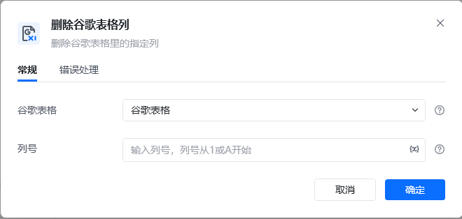
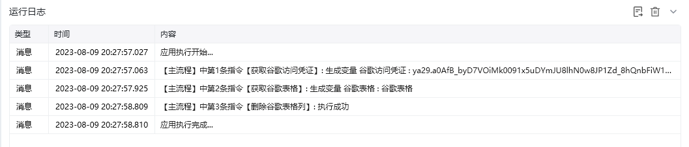

## 指令说明

**描述：** 删除谷歌表格里的指定列

## 参数说明

<Tabs>
  <Tab title="常规">
    

    | 参数 | 说明 |
    | --- | --- |
    | **谷歌电子表格** | 选择需要读取的谷歌表格 |
    | **列号** | 输入列号，列号从1或A开始 |
  </Tab>
  <Tab title="高级">
    本指令暂无高级参数。
  </Tab>
</Tabs>

## 使用示例

**该流程执行逻辑：**

使用【获取谷歌访问凭证】获取谷歌访问凭证，并将其保存至谷歌访问凭证中

使用【获取谷歌表格】获取谷歌表格，并将结果保存至谷歌表格中

使用【删除谷歌表格列】删除谷歌电子表格第4列

### 运行结果

<Info>
  使用指令过程中遇到问题？前往 [八爪鱼RPA 开发者社区问答板块](https://rpa.bazhuayu.com/community/questions) 提问，获取官方与社区帮助。
</Info>
